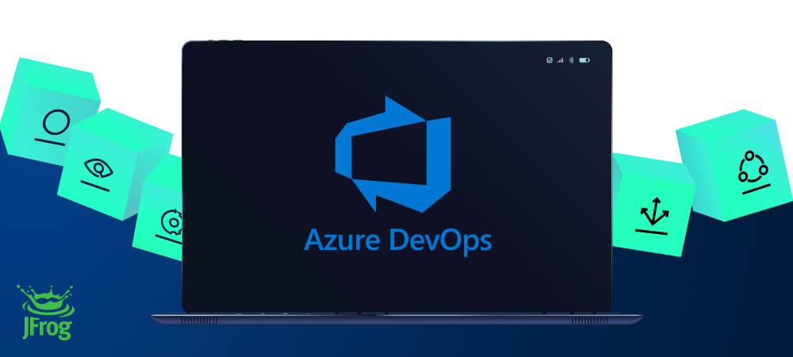

[](#readme)

<div align="center">

# JFrog Azure DevOps Extension

</div>

| Branch | Status                                                                                                                                                                                             |
|:------:|----------------------------------------------------------------------------------------------------------------------------------------------------------------------------------------------------|
|   v2   | [](https://ci.appveyor.com/project/jfrog-ecosystem/jfrog-azure-devops-extension/branch/v2)   |
|  dev   | [](https://ci.appveyor.com/project/jfrog-ecosystem/jfrog-azure-devops-extension/branch/dev) |

# Overview
JFrog provides tight integration with Azure DevOps through the **JFrog Extension**.
Beyond managing efficient deployment of your artifacts to Artifactory, the extension lets you capture information about artifacts deployed, dependencies resolved, environment data associated with the build runs and more, 
that effectively facilitates fully traceable builds.
See the full extension documentation at the [JFrog Azure DevOps Extension User Guide](https://www.jfrog.com/confluence/display/JFROG/JFrog+Azure+DevOps+Extension).

# Download and Installation [](https://marketplace.visualstudio.com/items?itemName=JFrog.jfrog-azure-devops-extension)
The extension is available for installation on your Azure DevOps organization in the [Azure DevOps Marketplace](https://marketplace.visualstudio.com/items?itemName=JFrog.jfrog-azure-devops-extension).
To install the extension on TFS, see the [install extensions for Team Foundation Server (TFS)](https://docs.microsoft.com/en-us/azure/devops/marketplace/get-tfs-extensions?view=tfs-2018#install-extensions-while-connected-to-tfs) documentation page.

# Building and Testing the Sources
## Building
To build and run the extension sources, please follow these steps:
1. Clone the code from git.
2. To Build and create the JFrog Artifactory extension `vsix` file, run the following command.
    ```
    npm i
    npm run create
    ```
After the build process is completed, you'll find the `vsix` file in the project directory.
The `vsix` file can be loaded into Azure DevOps and TFS.

## Testing
To run the tests, please make sure you are using node 14 or above.

Use the following commands to run from terminal:
1. Set the ADO_JFROG_PLATFORM_URL, ADO_JFROG_PLATFORM_USERNAME and ADO_JFROG_PLATFORM_PASSWORD environment variables with your JFrog Platform URL, username and password:
    ```
    export ADO_JFROG_PLATFORM_URL='https://myrepo.jfrog.io/'
    export ADO_JFROG_PLATFORM_USERNAME=admin
    export ADO_JFROG_PLATFORM_PASSWORD=password
    ```
   
2. Run the following commands:
    ```
    npm i -g jfrog-cli-v2-jf
    npm t
    ```

Note: If you are running tests via your IDE, make sure you are registering tests with ts-node: `mocha -r ts-node/register tests.ts -t 600000`. 

### Skipping Tests
In order to skip tests, set the ADO_SKIP_TESTS environment variable with the tests you wish to skip, separated by commas.
The supported values are: **maven**, **gradle**, **npm**, **go**, **nuget**, **dotnet**, **conan**, **pip**, **proxy**, **distribution**, **unit**, **installer** and **generic**.

For example, for skipping the nuget and dotnet tests:  
```
export ADO_SKIP_TESTS=nuget,dotnet
```
    
# Pull Requests
We welcome pull requests from the community!
## Guidelines
* Before creating your first pull request, please join our contributors' community by signing [JFrog's CLA](https://secure.echosign.com/public/hostedForm?formid=5IYKLZ2RXB543N).
* Pull requests should be created on the *dev* branch.
* Please make sure the code is covered by tests. 
* Please run `npm run format` for formatting the code before submitting the pull request.
* Please run `npm run lint` and make sure no new tslint warnings were introduced.

# Release Notes
See the release notes [here](https://www.jfrog.com/confluence/display/JFROG/JFrog+Azure+DevOps+Extension#JFrogAzureDevOpsExtension-ReleaseNotes).
