<div align="center">

[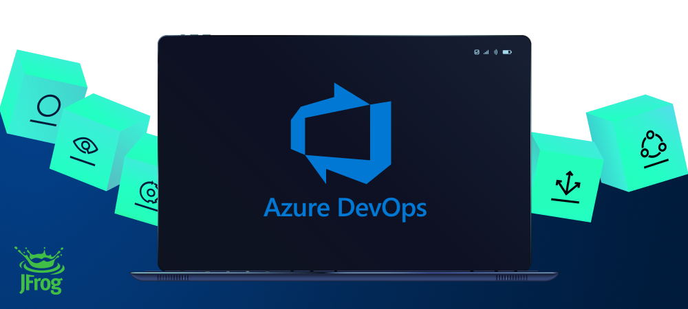](https://github.com/jfrog/jfrog-azure-devops-extension)

# JFrog Azure DevOps Extension

|                                                                                                           Azure DevOps Extension                                                                                                           | Installs                                                                                                                                                                                                                                                                                                    |                                                                                                                                   Tests (Master)                                                                                                                                    |                                                                                                                                           Tests (Dev)                                                                                                                                           |
|:------------------------------------------------------------------------------------------------------------------------------------------------------------------------------------------------------------------------------------------:|-------------------------------------------------------------------------------------------------------------------------------------------------------------------------------------------------------------------------------------------------------------------------------------------------------------|:-----------------------------------------------------------------------------------------------------------------------------------------------------------------------------------------------------------------------------------------------------------------------------------:|:-----------------------------------------------------------------------------------------------------------------------------------------------------------------------------------------------------------------------------------------------------------------------------------------------:|
| [)](https://marketplace.visualstudio.com/items?itemName=JFrog.jfrog-azure-devops-extension) | [](https://marketplace.visualstudio.com/items?itemName=JFrog.jfrog-azure-devops-extension)               | [](https://ci.appveyor.com/project/jfrog-ecosystem/jfrog-azure-devops-extension/branch/v2) |     [](https://ci.appveyor.com/project/jfrog-ecosystem/jfrog-azure-devops-extension/branch/dev)      |
|  [](https://marketplace.visualstudio.com/items?itemName=JFrog.jfrog-azure-devops-extension)  | [](https://marketplace.visualstudio.com/items?itemName=JFrog.jfrog-artifactory-vsts-extension) | [](https://ci.appveyor.com/project/jfrog-ecosystem/jfrog-azure-devops-extension/branch/v1) | [](https://ci.appveyor.com/project/jfrog-ecosystem/jfrog-azure-devops-extension/branch/dev-v1) |

</div>

# Overview

JFrog provides tight integration with [Azure DevOps](https://azure.microsoft.com/en-us/services/devops/) through the *[JFrog Extension](https://marketplace.visualstudio.com/items?itemName=JFrog.jfrog-azure-devops-extension)*
Beyond managing efficient deployment of your artifacts to Artifactory, the extension lets you capture information about
artifacts deployed, dependencies resolved, environment data associated with the build runs and more,
that effectively facilitates fully traceable builds.
JFrog brings continuous integration to [Azure DevOps](https://azure.microsoft.com/en-us/services/devops/) through the *JFrog* extension.

The *JFrog* extension for Azure DevOps supports:

* Running your builds while using JFrog Artifactory as the binary repository manager
* Gaining full traceability of your builds by capturing your build-info from your builds and publishing it to JFrog
  Artifactory
* Managing your binaries lifecycle with JFrog Artifactory
* Auditing your projects and scanning your builds with JFrog Xray
* Distributing your artifacts with JFrog Distribution.


## Table of contents

- [Table of contents](#Table-of-contents)
    - [Overview](#Overview)
    - [Download and Installation](#Download-and-Installation)
        - [Installing the Extension](#Installing-the-Extension)
        - [Installing the Build Agent](#Installing-the-Build-Agent)
        - [Configuring the Service Connections](#Configuring-the-Service-Connections)
    - [Executing JFrog CLI Commands](#Executing-JFrog-CLI-Commands)
    - [Build tools Tasks](#build-tools-tasks)
        - [JFrog Maven](#JFrog-Maven-Task)
        - [JFrog Gradle](#JFrog-Gradle-Task)
        - [JFrog Npm](#JFrog-Npm-Task)
        - [JFrog Nuget](#JFrog-Nuget-and-NET-Core-Task)
        - [JFrog .NET Core](#JFrog-Nuget-and-NET-Core-Task)
        - [JFrog Pip](#JFrog-Pip-Task)
        - [JFrog Conan](#JFrog-Conan-Task)
        - [JFrog Go](#JFrog-Go-Task)
    - [Build Tasks](#Build-tasks)
        - [JFrog Collect Build Issues](#JFrog-Collect-Build-Issues)
        - [JFrog Publish Build Info](#JFrog-Publish-Build-Info)
        - [JFrog Build Promotion](#JFrog-Build-Promotion)
        - [Discarding Published Builds](#Discarding-Published-Builds-from-Artifactory)
    - [Managing Generic Artifacts](#Managing-Generic-Artifacts)
    - [JFrog Xray](#JFrog-Xray-tasks)
        - [Audit project's dependencies for Security Vulnerabilities](#Audit-projects-dependencies-for-Security-Vulnerabilities)
        - [Scanning Published Builds for Security Vulnerabilities with JFrog Xray](#Scanning-Published-Builds-for-Security-Vulnerabilities)
    - [JFrog Docker Tasks](#JFrog-Docker-tasks)
        - [Pushing and Pulling Docker Images to and from Artifactory](#Pushing-and-Pulling-Docker-Images-to-and-from-Artifactory)
        - [Scanning Local Docker Images with JFrog Xray](#Scanning-Local-Docker-Images-with-JFrog-Xray)
    - [JFrog Distribution](#Managing-and-Distributing-Release-Bundles)
        - [JFrog Distribution Task](#JFrog-Distribution-V2-Task)
    - [Contributions](#Contribution)

## Download and Installation

### Installing the Extension

To install the JFrog extension, execute the following steps:

* Go to
  the [Visual Studio Marketplace Jfrog Extension Page](https://marketplace.visualstudio.com/items?itemName=JFrog.jfrog-azure-devops-extension)
  and sign in to your account.
    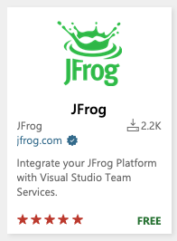
* Click on *Get It Free*.
  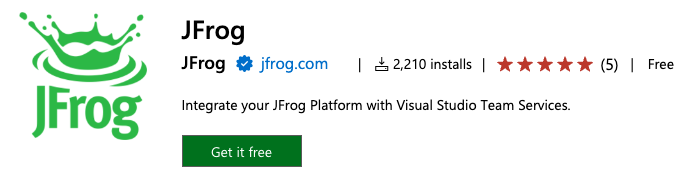
* Select the account to which you want to apply the extension and confirm installation.
  * In the JFrog Extension page, click *Install*.
  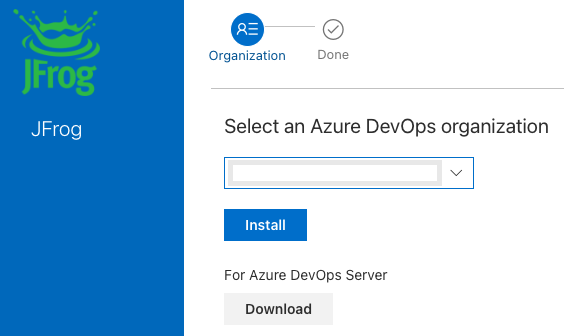

### Installing the Build Agent

To run the JFrog tasks, the build agents use three tools:

* JFrog CLI: Runs all the JFrog tasks.
* Maven Extractor (Used by the *JFrog Maven* task)
* Gradle Extractor (Used by the *JFrog Gradle* task)
* Conan client (Used by the *JFrog Conan* task)

<details>
  <summary>Automatic Installation</summary>

If the build agent has access to the internet, JFrog CLI along with the Maven and Gradle Extractors are downloaded and
installed automatically on the agent, the first time they are required.
</details>

<details>
  <summary>Custom tools Installation</summary>

You can configure the pipeline to download JFrog CLI and the Maven Extractor from a JFrog Artifactory instance, which is
configured to proxy the download repositories.

* Create two remote repositories in Artifactory:
* Create a remote repository in Artifactory for downloading *JFrog CLI*. Name the repository *jfrog-cli-remote* and
  set its URL
  to [https://releases.jfrog.io/artifactory/jfrog-cli/v2-jf/](https://releases.jfrog.io/artifactory/jfrog-cli/v2-jf/)
* Create a remote repository in Artifactory for downloading the *Maven and Gradle Extractors*. Name the URL *extractors* and set its URL
  to: [https://releases.jfrog.io/artifactory/oss-release-local/](https://releases.jfrog.io/artifactory/oss-release-local/)
* Make sure to configure the Artifactory server with the *jfrog-cli-remote* and *extractors* repositories in as a
  service connection in Azure DevOps of type *JFrog Artifactory V2*.
* Add the *JFrog Tools Installer* task to your build or release pipeline.
* Select the Artifactory service you configured.
* Select *jfrog-cli-remote* as the target repository to download the JFrog CLI.
* If your pipeline uses the *JFrog Maven* or *JFrog Gradle* tasks, select *extractors* as the repository to
  download the Maven Extractor.

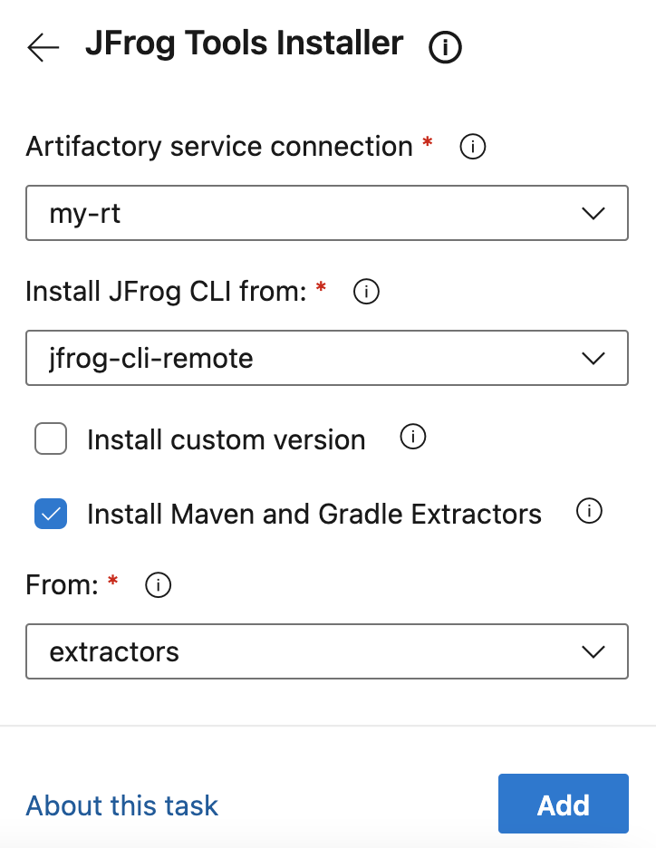

```YAML
- task: JFrogToolsInstaller@1
  inputs:
    artifactoryConnection: 'jfrog artifactory'
    cliInstallationRepo: 'jfrog-cli-remote'
    installExtractors: true
    extractorsInstallationRepo: 'extractors'
```

</details>

<details>
  <summary>Manual Installation</summary>

#### Manual Installation

##### Installing JFrog CLI

The extension runs JFrog CLI in the background to run many of its operations.
The extension automatically downloads and installs the JFrog CLI on the build agent the first time it's required.
However, if your build agent does not have access to the internet, the build will fail when attempting to download JFrog
CLI, and you'll need to download and install it manually.

To install JFrog CLI on an agent with no internet access:

1. Create the directory structure on your agent's `file-system: $(Agent.ToolsDirectory)/_jf/current/`
2. Download the latest JFrog CLI version from [here](https://releases.jfrog.io/artifactory/jfrog-cli/v2-jf/).
3. Please make sure to download the executable matching your agent's operating system. Make sure to download the *jf*
   executable of JFrog CLI and not the legacy *jfrog* executable.
4. Copy the downloaded *jf* executable to the *current* directory you created.

##### Installing the Maven Extractor

When triggering the *JFrog Maven* task, JFrog CLI automatically downloads the Maven Extractor jar to the build agent
the first time it's required.
However, if your build agent does not have access to the internet, the build will fail when attempting to download the
file.
You'll therefore need to download and install it manually.

To install the Maven Extractor jar on an agent with no internet access:

1. Create the directory structure on your agent's
   file-system: `$(Agent.ToolsDirectory)/_jf/.jfrog/dependencies/maven/2.x.x`
2. Download
   the latest [build-info-extractor-maven3-2.x.x-uber.jar](https://search.maven.org/artifact/org.jfrog.buildinfo/build-info-extractor)
   and place it inside the "maven" directory you created.

##### Installing the Gradle Extractor

When triggering the *JFrog Gradle* task, JFrog CLI automatically downloads the Gradle Extractor jar to the build
agent the first time it's required.
However, if your build agent does not have access to the internet, the build will fail when attempting to download the
file. You'll therefore need to download and install it manually.

To install the Gradle Extractor jar on an agent with no internet access:

1. Create the directory structure on your agent's
   file-system: `$(Agent.ToolsDirectory)/_jf/.jfrog/dependencies/gradle/4.x.x`
2. Download
   the latest [build-info-extractor-gradle-4.x.x-uber.jar](https://plugins.gradle.org/plugin/com.jfrog.artifactory)
   and place it inside the "gradle" directory you created.

##### Installing Conan

For the build agent to be able to run conan builds, do the following:

1. Access the agent and install conan by following [these steps](https://docs.conan.io/en/latest/installation.html).
2. Confirm that the conan executable is available in the Path environment variable of the user which runs the build on
   the agent.

Running Artifactory Conan tasks
Any structure on your agent's_file._The JFrog Conan task uses the Conan client. The Conan client cannot be installed
using the Automatic Installation or the JFrog Tools Installer but is required to be manually installed.
To install Conan on an agent, read the "Install Conan" section under [Manual Installation](#Manual-Installation)
The tools can be installed on the build agents using one of the following methods.

##### Using TFS 2015

Node.JS version 8 and above.

The build agent requires using Node.JS version 8 and above. To check which version of Node.JS is running on the build
agent:

1. Navigate to the_Worker\\Handlers\\Node_folder located under theAgent home.
2. From the terminal, run *node -v*

To upgrade Node.JS on the build agent:

* Replace the existing node.exe file on the agent with the node.exe file with the required version located in
  the_Worker\\Handlers\\Node_folder under the agent home.

</details>

## Configuring the Service Connections

To allow the JFrog tasks to work with your JFrog environment, you'll need to configure the following service connections
in Azure DevOps.

|                     Service connection                      | Used by tasks                                                                                                                                                                                                                                                                     |                
|:-----------------------------------------------------------:|:----------------------------------------------------------------------------------------------------------------------------------------------------------------------------------------------------------------------------------------------------------------------------------|
|   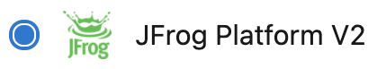   | JFrog CLI V2                                                                                                                                                                                                                                                                      | 
| 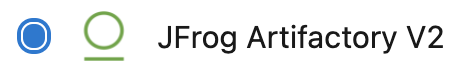  | JFrog Tools Installer<br>JFrog Generic Artifacts<br>JFrog Nuget<br>JFrog .NET Core<br>JFrog npm<br>JFrog Pip<br>JFrog Maven<br>JFrog Gradle<br>JFrog Go<br>JFrog Conan<br>JFrog Collect Build Issues<br>JFrog Discard Builds<br>JFrog Build Promotion<br>JFrog Publish Build Info |   
|     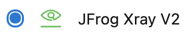     | JFrog Audit<br>JFrog Build Scan                                                                                                                                                                                                                                                   | 
| 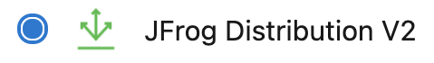 | JFrog Distribution                                                                                                                                                                                                                                                                | 

<details>
  <summary>Not Using a Public CA (Certificate Authority)?</summary>

This section is relevant for you, if you're not using a public CA (Certificate Authority) to issue the SSL certificate
used to connect to your JFrog instance domain.
You may not be using a public CA either because you're using self-signed certificates or you're running your own PKI
services in-house (often by using a Microsoft CA).
In this case, you'll need to make those certificates available for JFrog CLI, which is used by most of JFrog tasks.
To make the certificates available for JFrog CLI, you'll need to place them inside the security/certs directory, which
is under JFrog CLI's home directory.
The home directory default location is `$(Agent.ToolsDirectory)/_jf/`

Read more about this in the [JFrog CLI](https://www.jfrog.com/confluence/display/CLI/JFrog+CLI).
</details>

<details>
  <summary>Can't Access your JFrog instance?</summary>

For security reasons, the JFrog SaaS service supports only TLS 1.2. Since not all TFS versions support TLS 1.2, you may
need to enable TLS 1.2 on TFS.
To enable TLS 1.2 on TFS:

1. Create a file and name and name it: `Microsoft.PowerShell_profile.ps1`
2. Add the following line to the file: `[Net.ServicePointManager]::SecurityProtocol = [Net.SecurityProtocolType]::Tls12`
3. Place the file in the following location on the TFS machine: `C:\Users\<username>\Documents\WindowsPowerShell`

> Note: Make sure <username> matches the name of the user running TFS and the build agents.

</details>


<br>

## Executing JFrog CLI Commands

<details>
  <summary> JFrog CLI V2 Task</summary>

The extension support a generic [JFrog CLI](https://jfrog.com/help/r/jfrog-cli/jfrog-cli) task, named *JFrog CLI V2*,
which allows executing *[JFrog CLI](https://jfrog.com/help/r/jfrog-cli/jfrog-cli)* commands.
The command will use the connection details provided by the selected *JFrog Platform* service connection configured in
Azure DevOps,
so there's no need to provide the connection details as command options.

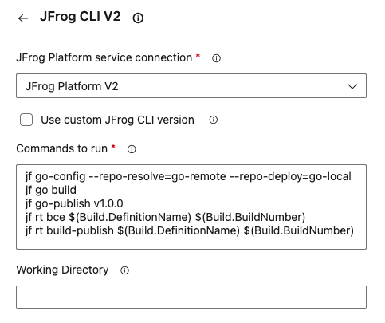

Single command example:

```YAML
- task: JfrogCliV2@1
  inputs:
    jfrogPlatformConnection: 'JFrog Platform V2'
    command: |
- task: JfrogCliV2@1
  inputs:
    jfrogPlatformConnection: 'JFrog Platform V2'
    command: |
      jf go-config --repo-resolve=go-remote --repo-deploy=go-local 
      jf go build 
      jf go-publish v1.0.0
      jf rt bce $(Build.DefinitionName) $(Build.BuildNumber)
      jf rt build-publish $(Build.DefinitionName) $(Build.BuildNumber)
```

Multiple commands example:

```YAML
- task: JfrogCliV2@1
  inputs:
    jfrogPlatformConnection: 'JFrog Platform V2'
    command: |
      jf rt ping
      jf terraform-config --repo-deploy=terraform-remote 
      jf terraform publish --namespace=example --provider=aws --tag=v0.0.1
```

</details>


<br>

## Managing Generic Artifacts

<details>
  <summary>JFrog Generic Artifacts task</summary>

The *JFrog Generic Artifacts* task supports following operations with JFrog Artifactory:

* Uploading artifacts to Artifactory
* Downloading artifacts from Artifactory
* Copying artifacts in Artifactory
* Moving artifacts in Artifactory
* Deleting artifacts in Artifactory
* Setting properties on artifacts in Artifactory
* Deleting properties from artifacts in Artifactory

The task triggers [JFrog CLI](https://www.jfrog.com/confluence/display/CLI/JFrog+CLI) to perform these actions
using [File Specs](https://www.jfrog.com/confluence/display/CLI/CLI+for+JFrog+Artifactory#CLIforJFrogArtifactory-UsingFileSpecs).
When the task is used for uploading and downloading artifacts, it can also be configured to capture the build-info,
which can be later published to Artifactory using the *JFrog Publish Build Info* task.

When configuring the task, do the following:

1. Select your configured *JFrog Artifactory V2* service connection.

2. Specify whether you'd like define the File Spec through the task UI or have the task read the spec from a file.

3. Set the File Spec content or a path to the File Spec.

4. Set the other task options.

5. Check the *Advanced* section for additional options.

### Generic artifacts handling

The *JFrog Generic Artifacts* task allows performing generic actions on artifacts, such as:

1. Downloading and uploading from/to Artifactory
2. Setting or deleting properties on artifacts in Artifactory
3. Moving, copying and deleting artifacts in Artifactory

### Downloading generic build dependencies from Artifactory

The task supports downloading your build dependencies from Artifactory to the build agent.
The downloaded dependencies are defined
using [File Specs](https://www.jfrog.com/confluence/display/CLI/CLI+for+JFrog+Artifactory#CLIforJFrogArtifactory-UsingFileSpecs)
and can be also configured to capture the build-info.
It will store the downloaded files as dependencies in the build-info which can later be published to Artifactory using
the *JFrog Publish Build-Info* task.


### Uploading generic build artifacts to Artifactory

The task also supports uploading your generated build artifacts from the build agent's local file system to Artifactory.
The artifacts are defined
using [File Specs](https://www.jfrog.com/confluence/display/CLI/CLI+for+JFrog+Artifactory#CLIforJFrogArtifactory-UsingFileSpecs).
The task can be also configured to capture build-info and stores the uploaded files as artifacts in the build-info. The
captured build-info can be later published to Artifactory using the *JFrog Publish Build-Info* task.


### Setting / Deleting properties on files in Artifactory

The JFrog Generic Artifacts task also allows both setting and deleting properties on artifacts in Artifactory.

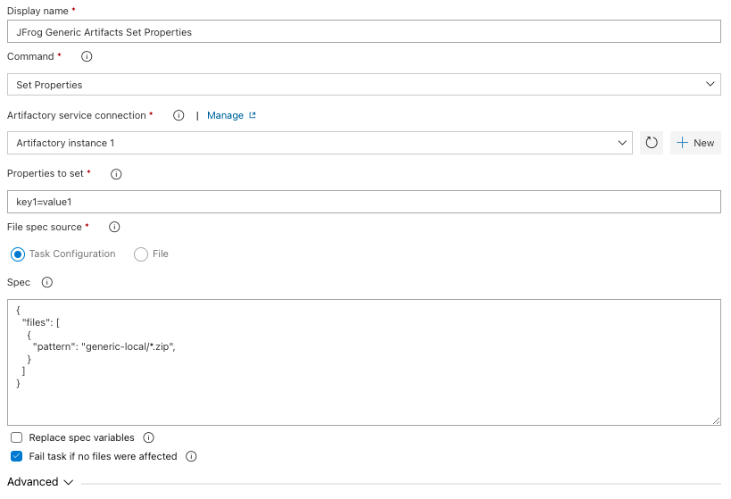

### Moving / Copying / Deleting artifacts in Artifactory

Same task also allows performing generic actions on artifacts in Artifactory.


YAML Example:

```YAML
- task: JFrogGenericArtifacts@1
  inputs:
    command: 'Upload'
    connection: 'jfrog artifactory'
    specSource: 'taskConfiguration'
    fileSpec: |
      {
        "files": [
          {
            "pattern": "libs-generic-local/*.zip",
            "target": "dependencies/files/"
          }
        ]
      }
    collectBuildInfo: true
    buildName: '$(Build.DefinitionName)'
    buildNumber: '$(Build.BuildNumber)'
    projectKey: 'proj'
    includeEnvVars: true
    failNoOp: true
```

</details>


<br>

## Build tools Tasks


### JFrog Maven Task

<details>
  <summary>...</summary>


The *JFrog Maven* task allows triggering Maven builds, while resolving dependencies and deploying artifacts from and
to Artifactory.
The task uses the configured *JFrog Artifactory V2* service connection.
The task can also be configured to capture build-info and store the downloaded and uploaded artifacts as build
dependencies and build artifacts.
The captured build-info can be later published to Artifactory using the *[JFrog Publish Build-Info](#JFrog-Publish-Build-Info)* task.

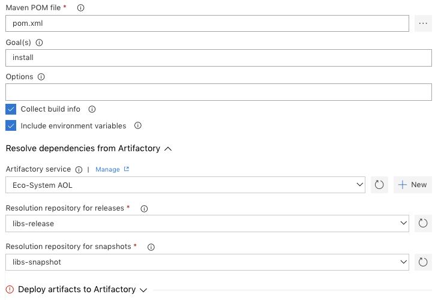

You also have the option of filtering out some of the Maven artifacts that will be deployed to Artifactory.
You do this by defining one or more include patterns. You can also define one or more exclude patterns.
The patterns can include wildcards and should be separated by a comma followed by a white-space as shown below.

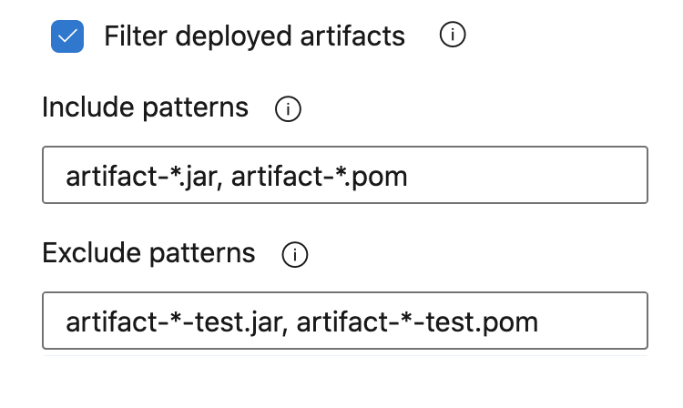

```YAML
- task: JFrogMaven@1
  inputs:
    mavenPomFile: 'pom.xml'
    goals: 'install'
    artifactoryResolverService: 'jfrog artifactory'
    targetResolveReleaseRepo: 'libs-release'
    targetResolveSnapshotRepo: 'libs-snapshot'
    artifactoryDeployService: 'jfrog artifactory'
    targetDeployReleaseRepo: 'libs-release'
    targetDeploySnapshotRepo: 'libs-snapshot'
    filterDeployedArtifacts: true
    includePatterns: 'artifact-*.jar,artifact-*.pom'
    excludePatterns: 'artifact-*-test.jar,artifact-*-test.pom'
    collectBuildInfo: true
    buildName: '$(Build.DefinitionName)'
    buildNumber: '$(Build.BuildNumber)'
    includeEnvVars: true
```

For more information about Maven repositories,
see [Artifactory Maven Repository](https://jfrog.com/help/r/jfrog-artifactory-documentation/maven-repository)
</details>

### JFrog Gradle Task
<details>
   <summary>...</summary>

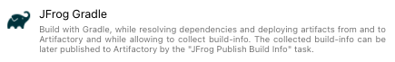

The *JFrog Gradle* task allows triggering Gradle builds, while resolving dependencies and deploying artifacts from and
to Artifactory.
The task uses the configured *JFrog Artifactory V2* service connection.

The task can also be configured to capture build-info and store the downloaded and uploaded artifacts as build
dependencies and build artifacts.
The captured build-info can be later published to Artifactory using the *[JFrog Publish Build-Info](#JFrog-Publish-Build-Info)* task.

Behind the scenes, the *JFrog Gradle* task uses
the [Gradle Artifactory Plugin](https://jfrog.com/help/r/jfrog-integrations-documentation/gradle-artifactory-plugin) to
integrate with the Gradle build.
In case your Gradle script already applies
the [Gradle Artifactory Plugin](https://jfrog.com/help/r/jfrog-integrations-documentation/gradle-artifactory-plugin),
set the *Use Artifactory Plugin* option, to let the task know that it shouldn't apply the plugin in the Gradle script.

You should set *artifactoryPublish* as one of the Gradle tasks in the task(s) fields.
*artifactoryPublish* is a task that is exposed by the Gradle Artifactory Plugin, and is used for deploying artifacts
as well as publishing build-info to Artifactory.

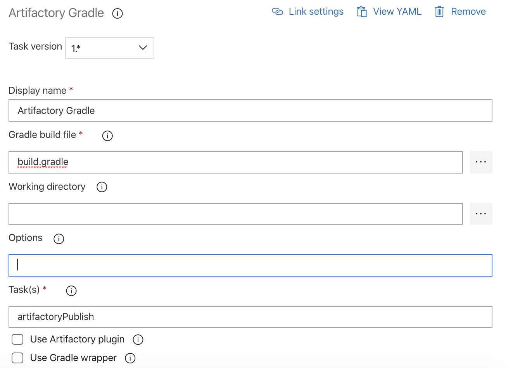

```YAML
- task: JFrogGradle@1
  inputs:
    gradleBuildFile: 'build.gradle'
    tasks: 'artifactoryPublish'
    artifactoryResolverService: 'jfrog artifactory'
    sourceRepo: 'gradle-virtual'
    artifactoryDeployerService: 'jfrog artifactory'
    targetRepo: 'gradle-local'
```

</details>

### JFrog Npm Task
<details>
  <summary>...</summary>

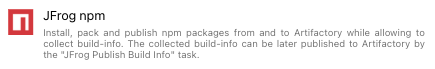

The *JFrog Npm* task allows triggering npm builds, while resolving npm dependencies and deploying npm packages from
and to Artifactory.
The task uses the configured *JFrog Artifactory V2* service connection.

The task can be also configured to capture build-info and store the uploaded files as artifacts in it.
The captured build-info can be later published to Artifactory using the *[JFrog Publish Build-Info](#JFrog-Publish-Build-Info)* task.

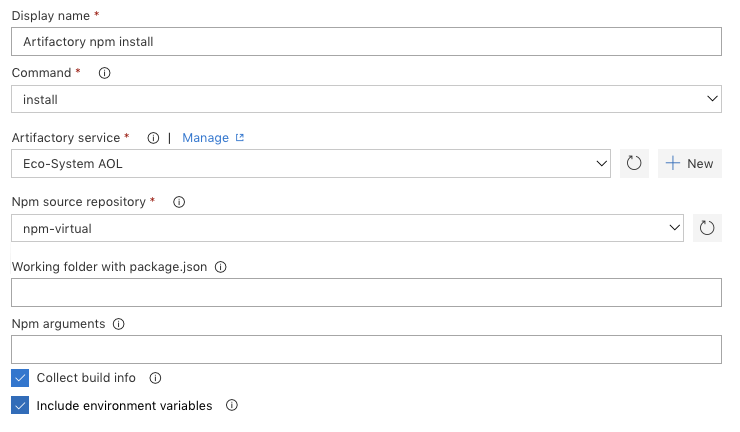

```YAML
- task: JFrogNpm@1
  inputs:
    command: 'install'
    artifactoryConnection: 'jfrog artifactory'
    sourceRepo: 'npm-virtual'
    collectBuildInfo: true
    threads: '1'
    buildName: '$(Build.DefinitionName)'
    buildNumber: '$(Build.BuildNumber)'
    includeEnvVars: true
```

For information on npm repositories,
see [Artifactory npm Registry](https://jfrog.com/help/r/jfrog-artifactory-documentation/npm-registry)

</details>


### JFrog Nuget and .NET Core Task
<details>
  <summary>...</summary>


The *JFrog Nuget* and *JFrog .NET Core* tasks allow restoring NuGet packages from Artifactory.
These tasks also allow publishing NuGet packages to Artifactory.
The task uses the configured *JFrog Artifactory V2* service connection.
The tasks can be configured to capture build-info.
The build-info stores the restored packages as build dependencies and uploaded packages as build artifacts.
The captured build-info can be later published to Artifactory using the *[JFrog Publish Build-Info](#JFrog-Publish-Build-Info)* task.

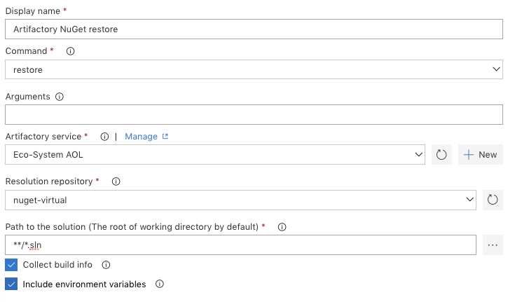

```YAML
- task: JFrogDotnetCore@1
  inputs:
    command: 'restore'
    artifactoryConnection: 'jfrog artifactory'
    targetResolveRepo: 'nuget-virtual'
    rootPath: '*/*.sln'
    collectBuildInfo: true
    buildName: '$(Build.DefinitionName)'
    buildNumber: '$(Build.BuildNumber)'
    includeEnvVars: true
```

For more information about Nuget repositories,
see [Artifactory NuGet Repositories](https://jfrog.com/help/r/jfrog-artifactory-documentation/nuget-repositories)
</details>

### JFrog pip Task
<details>
  <summary>...</summary>

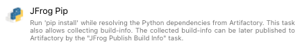

The *JFrog Pip* task allows installing Pip packages from Artifactory.
The task uses the configured *JFrog Artifactory V2* service connection.
The tasks can also be configured to capture build-info. The build-info stores the installed packages as build
dependencies.
The captured build-info can be later published to Artifactory using
the [Publishing Build Info to Artifactory](http://www.jfrog.com#PublishingBuildInfotoArtifactory) task.

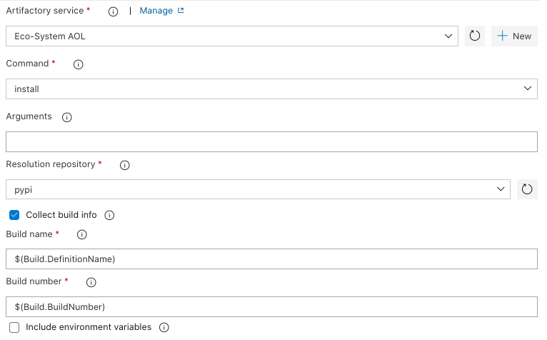

```YAML
- task: JFrogPip@1
  inputs:
    artifactoryConnection: 'jfrog artifactory'
    command: 'install'
    targetResolveRepo: 'pypi'
    collectBuildInfo: true
    buildName: '$(Build.DefinitionName)'
    buildNumber: '$(Build.BuildNumber)'
```

*Recording all dependencies as part of the build-info*
When running the *JFrog Pip* task inside a Python environment, which already has some of the packages installed, the
installed packages will not be included as part of the build-info, if they were not originally installed from
Artifactory. A warning message will be added to the build log in this case.

*How to include all packages in the build-info?*
Running the task for the first time with the *Disable local pip cache* option checked,
should re-download and install these packages, and they will therefore be included in the build-info.
It is also recommended to run the command from inside
a [virtual environment](https://packaging.python.org/guides/installing-using-pip-and-virtual-environments/).
The *Virtual environment setup command* field allows this.

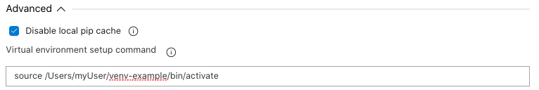

Behind the scenes, the task uses JFrog CLI as a wrapper for pip.
JFrog CLI also includes a caching mechanism, which stores the details of the dependencies locally, making sure they are
included in the build-info, even if they are already cached locally.

</details>

### JFrog Conan Task
<details>
  <summary>...</summary>


[Conan](https://conan.io/) is a package manager for C and C++.

The *JFrog Conan* task allows triggering a conan build while resolving conan dependencies from a conan repository in
Artifactory.
The task uses the configured *JFrog Artifactory V2* service connection.
It also allows publishing conan packages to an Artifactory conan repository.
The task can be also configured to capture build-info and store the downloaded and uploaded packages as build
dependencies and artifact.
The captured build-info can be later published to Artifactory using the *[JFrog Publish Build-Info](#JFrog-Publish-Build-Info)* task.

The task supports the *config install* , *add remote* , *create* and *upload* conan commands.
In addition, it supports a *custom* option, allowing to configure the task to execute any conan command.
The full documentation of Conan is available at the [conan website](https://docs.conan.io/en/latest/).

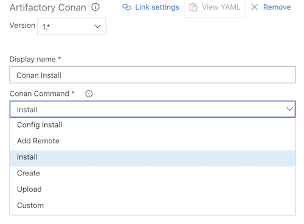

```YAML
- task: JFrogConan@1
  inputs:
    conanCommand: 'Install'
    pathOrReference: './'
    buildName: '$(Build.DefinitionName)'
    buildNumber: '$(Build.BuildNumber)'
```

For more information about Conan repositories,
see [Artifactory Conan Repositories](https://jfrog.com/help/r/jfrog-artifactory-documentation/conan-repositories)
</details>

### JFrog Go Task
<details>
  <summary>...</summary>

The *JFrog Go* task allows triggering a go build, while resolving go dependencies from a go repository in Artifactory.
The task uses the configured *JFrog Artifactory V2* service connection.
It also allows publishing go packages to an Artifactory go repository.
The task can be also configured to capture build-info and store the downloaded and uploaded packages as build
dependencies and artifact.
The captured build-info can be later published to Artifactory using the *JFrog Publish Build-Info* task.

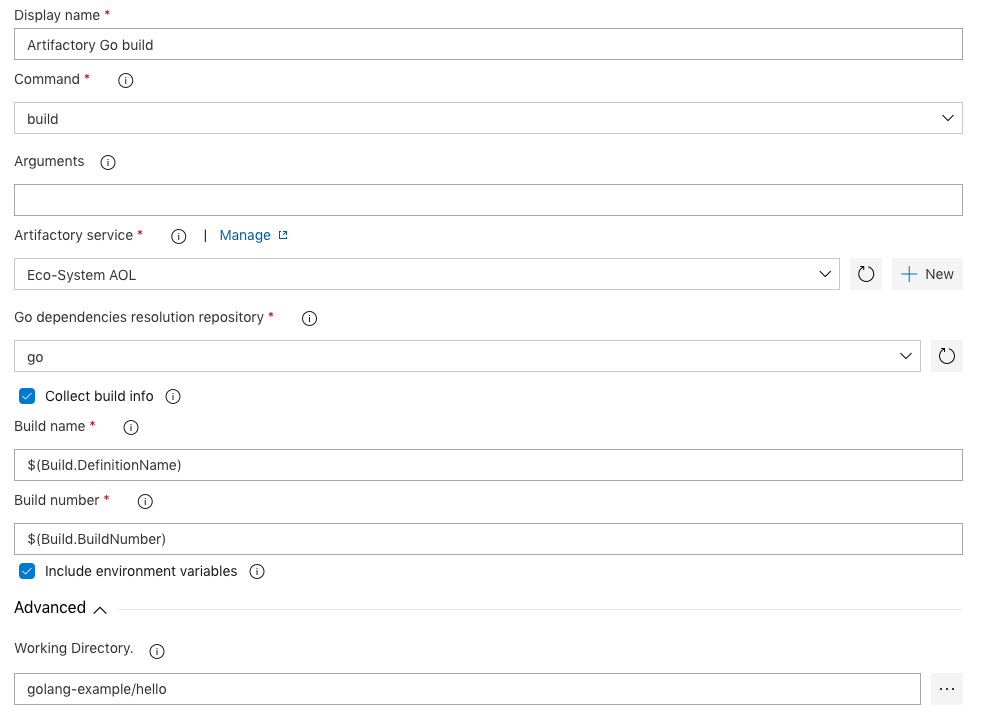

```YAML
- task: JFrogGo@1
  inputs:
    command: 'build'
    artifactoryConnection: 'jfrog artifactory'
    resolutionRepo: 'go'
    collectBuildInfo: true
    buildName: '$(Build.DefinitionName)'
    buildNumber: '$(Build.BuildNumber)'
    includeEnvVars: true
    workingDirectory: 'golang-example/hello'
```

For more information about Go repositories,
see [Artifactory Go Repositories](https://jfrog.com/help/r/jfrog-artifactory-documentation/go-registry)
</details>


<br>

## Build Tasks


### JFrog Collect Build Issues
<details>
  <summary>...</summary>

Being able to look at the build which was published to Artifactory, and see all JIRA issues associated with it, is one
of the most powerful capabilities of Artifactory when it comes to managing metadata about artifacts builds.

The *JFrog Collect Build Issues* task collects the list of tracked project issues (for example, issues stored in JIRA,
GitHub or any other bug tracking systems, and adds these issues to the build-info.
The task uses the configured *JFrog Artifactory V2* service connection. The issues are collected by reading the git
commit messages from the local git log.
Each commit message is matched against a pre-configured regular expression, which retrieves the issue ID and issue
summary.
The information required for collecting the issues is retrieved from a yaml configuration, which is set as part for the
task.

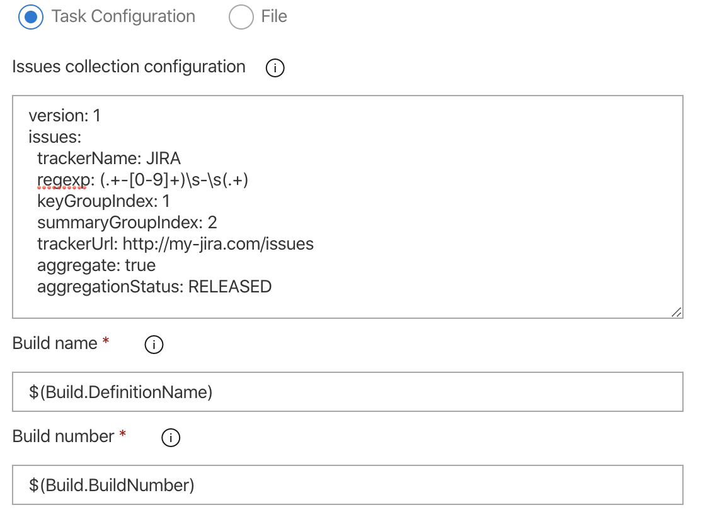

Here's the yaml configuration structure.

```YAML
version: 1
issues:
  trackerName: JIRA
  regexp: (.+-[0-9]+)\s-\s(.+)
  keyGroupIndex: 1
  summaryGroupIndex: 2
  trackerUrl: https://my-jira.com/issues
  aggregate: true
  aggregationStatus: RELEASED
```

##### Configuration properties

| Property name     | Description                                                                                                                                                                                                                                                                                                             |
|-------------------|-------------------------------------------------------------------------------------------------------------------------------------------------------------------------------------------------------------------------------------------------------------------------------------------------------------------------|
| Version           | The schema version is intended for internal use. Do not change!                                                                                                                                                                                                                                                         |
| trackerName       | The name (type) of the issue tracking system. For example, JIRA. This property can take any value.                                                                                                                                                                                                                      |
| regexp            | A regular expression used for matching the git commit messages. The expression should include two capturing groups - for the issue key (ID) and the issue summary. In the example above, the regular expression matches the commit messages as displayed in the following example:<br>HAP-1007 - This is a sample issue |
| keyGroupIndex     | The capturing group index in the regular expression used for retrieving the issue key. In the example above, setting the index to "1" retrieves HAP-1007 from this commit message:<br>HAP-1007 - This is a sample issue                                                                                                 |
| summaryGroupIndex | The capturing group index in the regular expression for retrieving the issue summary. In the example above, setting the index to "2" retrieves the sample issue from this commit message:<br>HAP-1007 - This is a sample issue                                                                                          |
| trackerUrl        | The issue tracking URL. This value is used for constructing a direct link to the issues in the Artifactory build UI.                                                                                                                                                                                                    |
| aggregate         | Set to true, if you wish all builds to include issues from previous builds.                                                                                                                                                                                                                                             |
| aggregationStatus | If aggregate is set to true, this property indicates how far in time should the issues be aggregated. In the above example, issues will be aggregated from previous builds, until a build with a RELEASE status is found. Build statuses are set when a build is promoted using the jfrog rt build-promote command.     |

The yaml configuration can be either be stored as text as part of the task configuration, or stored in a file.
The file can be saved in the source control, and fetched, together with the rest of the sources to the build agent.
It can then be accesses and used by this task.

</details>

### JFrog Publish Build Info
<details>
  <summary>...</summary>

Most of the JFrog tasks can be configured to collect and store build-info locally.
The task uses the configured *JFrog Artifactory V2* service connection.
The collected build info can be then published to Artifactory using the *JFrog Publish Build Info* task.

For more information about Build Info,
see [Artifactory Build Integration](https://jfrog.com/help/r/jfrog-cli/build-integration)

When configuring the task, select your configured Artifactory service endpoints and specify whether you'd like to
collect environment variables from the agent and add them to the build-info.


```YAML
- task: JFrogPublishBuildInfo@1
  inputs:
    buildName: '$(Build.DefinitionName)'
    buildNumber: '$(Build.BuildNumber)'
    excludeEnvVars: '*password*;*psw*;*secret*;*key*;*token*;*auth*;'
```

After the build-info is published to Artifactory, it can be accessed from the *Artifactory* tab in the Build Results.


</details>

### JFrog Build Promotion
<details>
  <summary>...</summary>

To support the artifacts life-cycle, Artifactory supports promoting published builds from one repository to another.

The *JFrog Build Promotion* task promotes a build, by either copying or moving the build artifacts and/or dependencies
to a target repository.

This task can be added as part of a Build or Release pipeline.

Run these steps to configure the *JFrog Build Promotion* task:

1. Select the configured *JFrog Artifactory V2* service connection, to which the build has been published.

2. Specify the name of a* target repository* to which the build should be promoted.

3. Set the *status* of the build and optionally add a *Comment*. These details will be visible as part of the Build
   History in the Artifactory UI.

4. (Optional) Set a *source repository* for the promotion.

5. Select the *include build dependencies* if you want the build dependencies to be promoted.

6. To copy and not to move the artifacts to the target repository, select the *Use copy* option to copy the artifacts
   to the target repository.

7. Select *Dry run* to test the promotion prior to running the build promotion.


```YAML
- task: JFrogBuildPromotion@1
  inputs:
    artifactoryConnection: 'jfrog artifactory'
    buildName: '$(Build.DefinitionName)'
    buildNumber: '$(Build.BuildNumber)'
    targetRepo: 'staging-local'
    status: 'Released'
    comment: 'Promoting release candidate'
    sourceRepo: 'Dev1-local'
    includeDependencies: false
    copy: true
    dryRun: false
```

##### Using Build Promotion in a Release

You can control the life cycle of your artifacts by promoting them from one Artifactory repository to another.
Build Promotion can come in handy when embedding it as part of release pipeline in Azure DevOps.
To help you achieve this, follow these steps for creating a release which includes the *JFrog Build Promotion* task.

1. Create a new Release.
   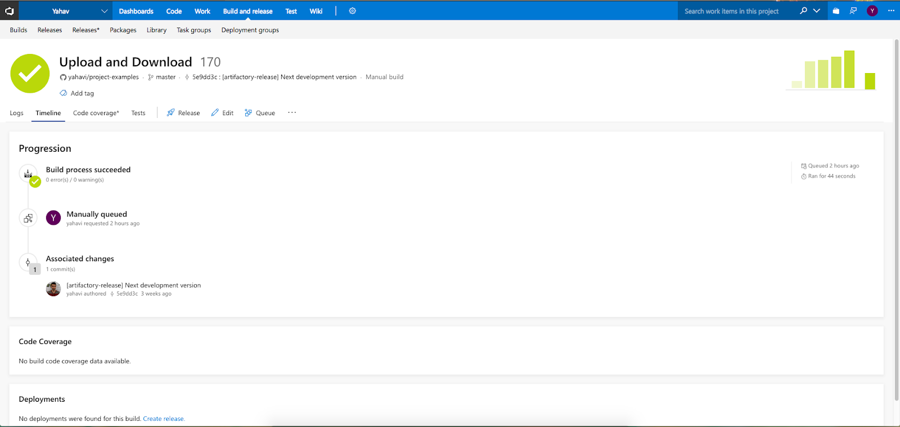
2. Click *environment* and select a template for the release.
   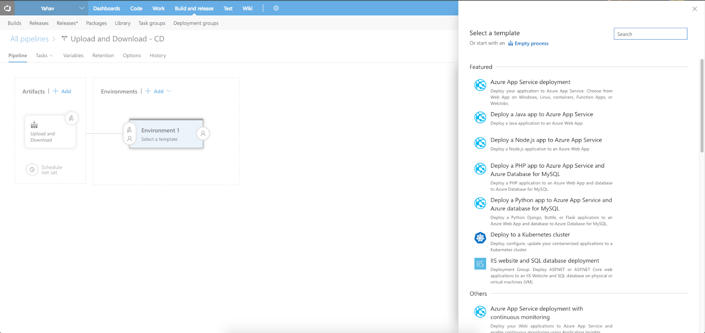
3. Click *Artifact* and select *Build* as the source type.
4. Fill out the rest of the form details.
5. If you'd like this release to always use the latest build from Artifactory, select specify a specific build number
   as the *Default version* and select one of the available build number i the *Build number* list box.
6. If you'd like to promote a specific build number during the release, select specify at the time of release
   creation as the *Default version*:
   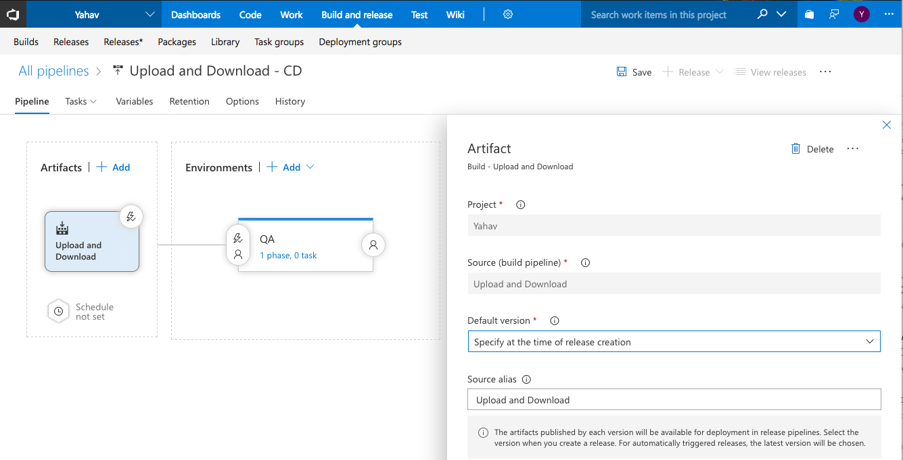
7. If you wish to promote the latest build number, select specify a specific build number as the *Default version*
   and then select *any* build number. Then, click on the *Variables* tab and add
   the *ARTIFACTORY\_RELEASE\_BUILD\_NUMBER* pipeline variable with *LATEST* as the value.
   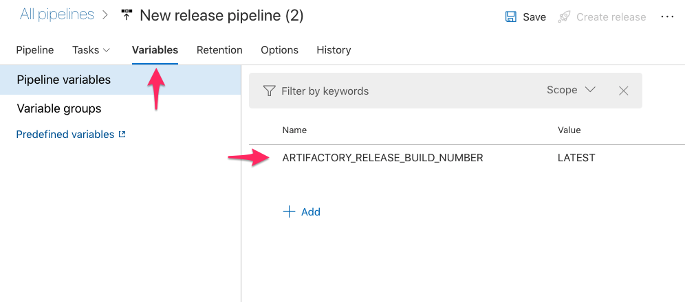
8. Configure the *Artifactory Build Promotion* task as one of your release pipeline tasks.
   The task uses a build number which will be selected later on, upon creating a release.
   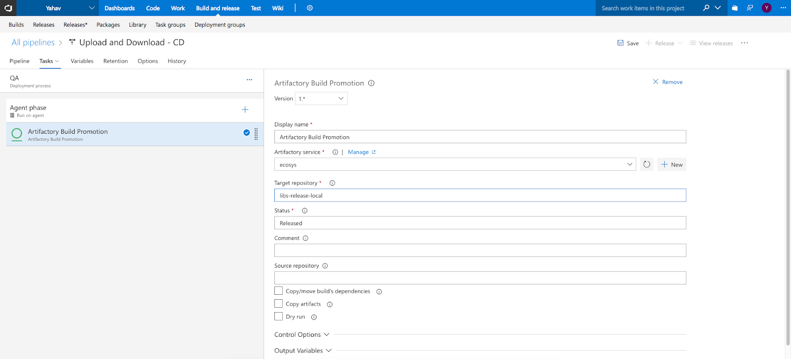
9. That's it, you're done!
   Now you can create the release. The build number that you'll choose is that one which will be promoted in
   Artifactory.
   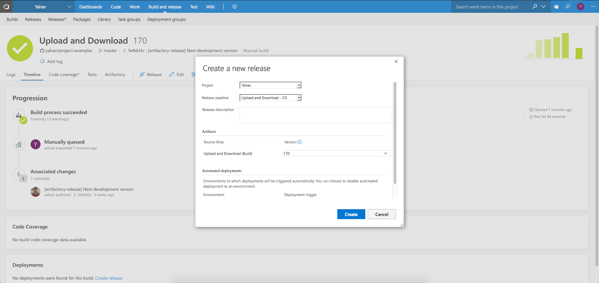

</details>

### Discarding Published Builds from Artifactory
<details>
  <summary>...</summary>

To discard old runs of a build from Artifactory, add the *JFrog Discard Builds* task to the pipeline.

Run these steps to configure the task.

1. Select the configured *JFrog Artifactory V2* service connection, on which you'd like the builds to be discarded.

2. Type the name of the build.

3. Optionally set the maximum days to keep build runs. Build runs which are older will be discarded.

4. Optionally set the maximum number of builds to keep.

5. Optionally set of build runs in the form of 10,11,12,... to keep and not to discard.

6. Check the_Delete artifacts_checkbox, to also delete the build artifacts and not only the build meta-data.

7. Check the Async checkbox, to make the action asynchronous. In this case, the pipeline will not wait for the action to
   finish, but the pipeline will not be notified in case of a failure.
   

```YAML
- task: JFrogDiscardBuilds@1
  inputs:
    artifactoryConnection: 'jfrog artifactory'
    buildName: '$(Build.DefinitionName)'
    maxDays: '60'
    maxBuilds: '400'
    excludeBuilds: '10,11,12'
    deleteArtifacts: true
```

</details>

<br>

## JFrog Xray tasks


### Audit project's dependencies for Security Vulnerabilities
<details>
  <summary>...</summary>


The *JFrog Audit* task triggers an audit of your project dependencies for security vulnerabilities with JFrog Xray.
The task uses the configured *JFrog Xray V2* service connection.
The scan is synchronous, meaning the tasks waits for the scan to finish.
To determine the policy for identifying the vulnerabilities, you can either set a list for Xray Watches or select a
JFrog Project or path in Artifactory associated with the policy.

> This functionality requires version 3.29.0 or above of JFrog Xray.


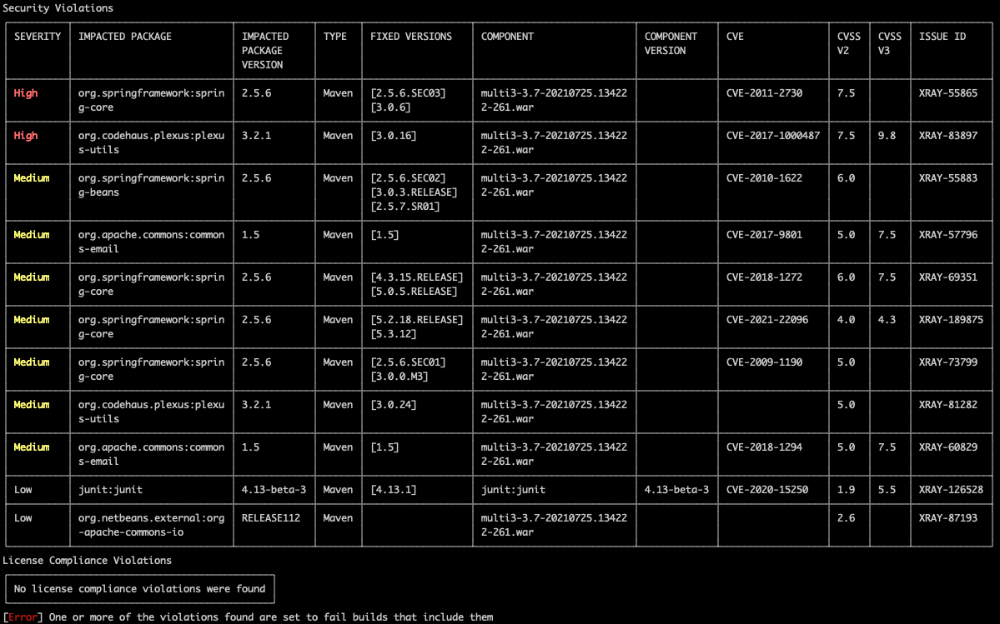

```YAML
- task: JFrogAudit@1
  inputs:
    xrayConnection: 'jfrog xray token'
    watchesSource: 'watches'
    watches: 'watch1,watch2'
    allowFailBuild: true
```

</details>

### Scanning Published Builds for Security Vulnerabilities
<details>
  <summary>...</summary>

The *JFrog Build Scan* task allows triggering a build scan with JFrog Xray.
For the build to be scanned, it first needs to be published to Artifactory using the *[JFrog Publish Build-Info](#JFrog-Publish-Build-Info)* task.
The task uses the configured *JFrog Xray V2* service connection.
When the scan is triggered, Xray starts scanning the build artifacts and dependencies.
The scan is synchronous, meaning the tasks waits for the scan to finish.
If the *Allow fail build* task option is set and Xray is configured to fail the build, the build pipeline will fail,
if vulnerabilities are found.

> This functionality requires version 3.37.0 or above of JFrog Xray.


```YAML
- task: JFrogBuildScan@1
  inputs:
    xrayConnection: 'jfrog xray token'
    buildName: '$(Build.DefinitionName)'
    buildNumber: '$(Build.BuildNumber)'
    allowFailBuild: true
    vuln: false
```

After the Xray scan is completed, a vulnerabilities table is printed to the task run logs, along with a link to the
build-info report.


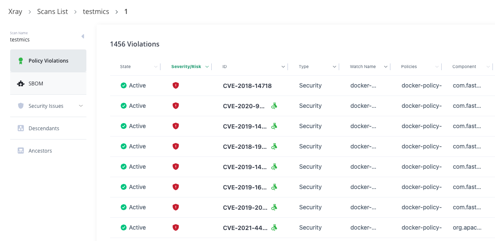

</details>


<br>

## JFrog Docker tasks


### Pushing and Pulling Docker Images to and from Artifactory
<details>
  <summary>...</summary>

The *JFrog Docker* task allows pushing and pulling docker images to and from a docker repository in Artifactory.
The task can be also configured to capture build-info for the pushed or pulled image.
In addition to details about the build and the build environment, the build info includes the image layers as build
dependencies and build artifacts.
The task stores build info locally on the build agent.
The stored build-info can be later published to Artifactory using the *JFrog Publish Build Info* task.

> This functionality requires version 7.33.3 or above of Artifactory.

For more information about Docker and Artifactory,
see [Artifactory Docker Registry](https://jfrog.com/help/r/jfrog-artifactory-documentation/docker-registry)

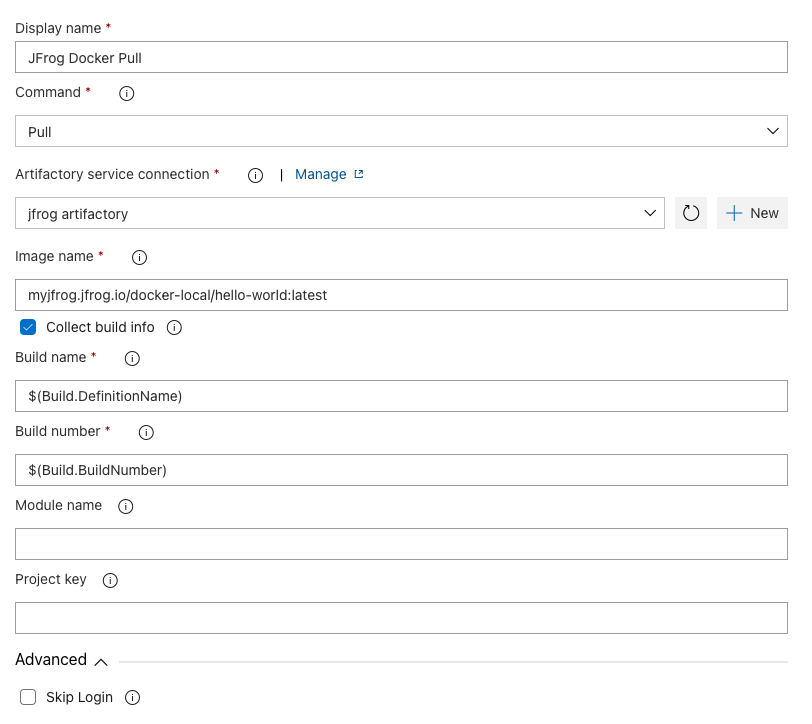

```YAML
- task: JFrogDocker@1
  inputs:
    command: 'Pull'
    artifactoryConnection: 'jfrog artifactory'
    imageName: 'myjfrog.jfrog.io/docker-local/hello-world:latest'
    collectBuildInfo: true
    buildName: '$(Build.DefinitionName)'
    buildNumber: '$(Build.BuildNumber)'
    skipLogin: false
```

</details>


### Scanning Local Docker Images with JFrog Xray
<details>
  <summary>...</summary>

The *JFrog Docker* task allows scanning local docker images using JFrog Xray. The scan results is displayed in the
build log.

By default, the result will include all vulnerabilities found. You may however configure the task to show only
violations configured in Xray.

You do this by configuring the task to use:

1. Your JFrog Project. If there are Xray Watches associated with this Project, these Watches will be used.

2. Xray Watch or a list of Watches.

3. Repository path in Artifactory which has Xray Watches associated with it.

> This functionality requires version 3.40.0 or above of JFrog Xray.

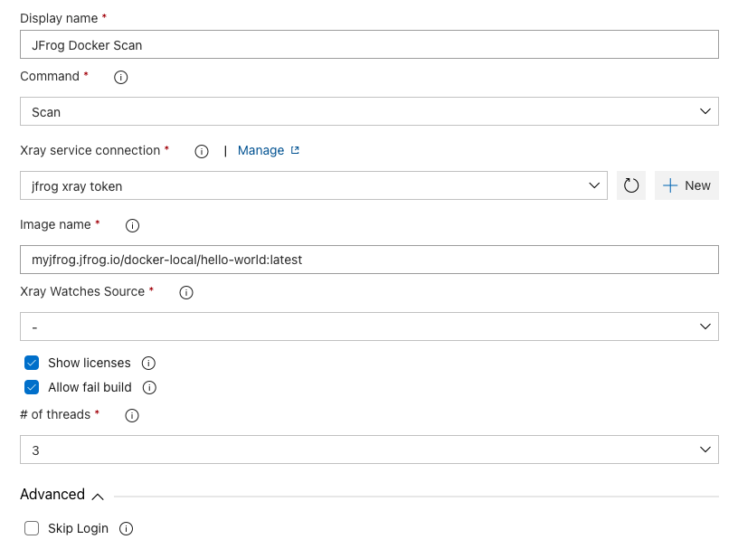

```YAML
- task: JFrogDocker@1
  inputs:
    command: 'Scan'
    xrayConnection: 'jfrog xray token'
    watchesSource: 'none'
    licenses: true
    allowFailBuild: true
    threads: '3'
    skipLogin: false
```

</details>


<br>

## Using Published Artifacts in a Release


Artifacts which were published to Artifactory can be made available for a Release Pipeline.
There are two ways to achieve this:

<details>
    <summary>Using JFrog Generic Artifacts task</summary>

The first way is to use the [JFrog Generic Artifacts](#Managing-Generic-Artifacts) task to download the files during the
release. Read more about this in
the Downloading Generic Dependencies from Artifactory section.

</details>

<details>
    <summary>Using Azure Artifact source</summary>

You can also set Artifactory as an artifact source for the release.
This allows downloading the artifacts for a build which was previously published to Artifactory.
Read more about publishing builds to Artifactory in the Publishing Build
Info to Artifactory section.

Follow these steps to add Artifactory as an artifact source to a Release.

1. Create a new Release and click on *Artifacts Add*

   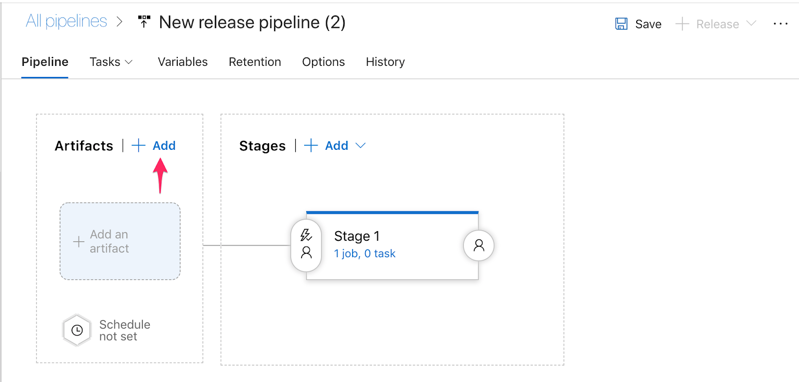

2. Select the *Artifactory* source type.

   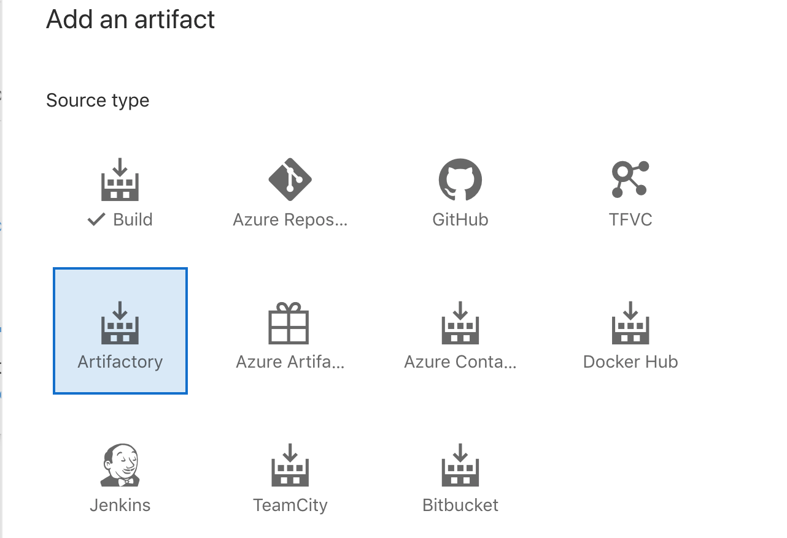

3. Select an Artifactory service, a build name, and the default version to use.

   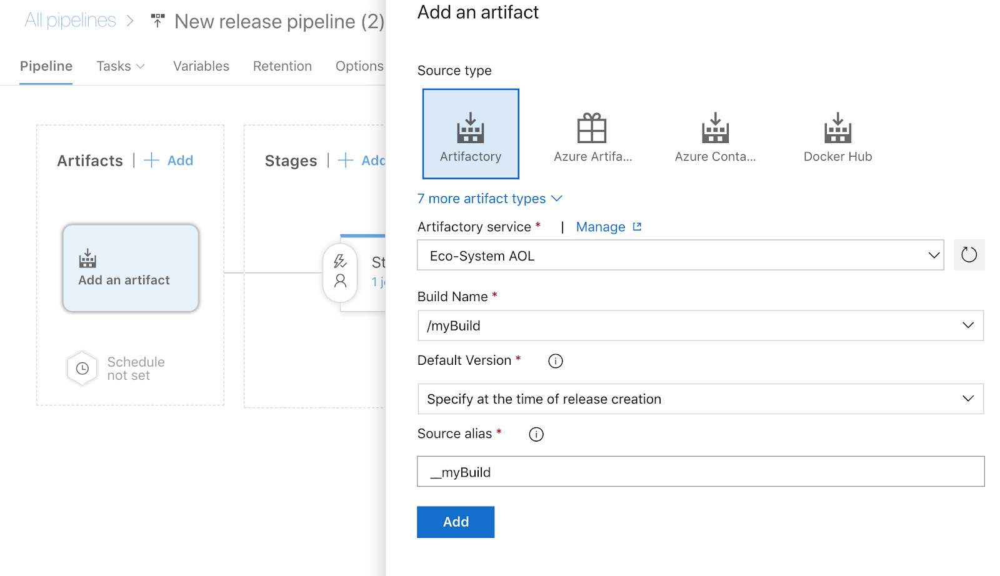

   That's it! You're done.

   Now, when initiating the Release, the artifacts associated with the defined build are downloaded to the release
   agent.

</details>


<br>

## Managing and Distributing Release Bundles


### JFrog Distribution V2 Task
<details>
  <summary>...</summary>

[JFrog Distribution](https://jfrog.com/help/r/jfrog-distribution-documentation) is a centralized platform that lets you
provision software release distribution.
It is a core part of JFrog Enterprise+,
managing [Release Bundles](https://jfrog.com/help/r/jfrog-distribution-documentation/distributing-release-bundles) and
their distribution processes,
including release content, permission levels, and target destinations.
Distribution provides a secure and structured platform to distribute release binaries to multiple remote locations and
update them as new release versions are produced.
As part of the release flow, release bundles are verified by the target destination to ensure that they are signed
correctly and safe to use.
JFrog DistributionDistributing Release Bundles

The *JFrog Distribution* task allows creating, updating, signing and deleting release bundles.
It also allows distributing the release to the edge nodes.

* The task requires configuring your *JFrog Distribution V2* instance as a service connection in Azure DevOps.
* You can then set the instance you configured as the Distribution service value in the task.
* The task triggers [JFrog CLI](https://jfrog.com/help/r/jfrog-cli/jfrog-cli) to execute the distribution actions.
* When creating or updating a release bundle, you need to
  provide [File Specs](https://jfrog.com/help/r/jfrog-integrations-documentation/using-file-specs) defining the
  artifacts to be included in the release bundle.
* When distributing a release bundle, you can control the distribution destinations by defining rules distribution rules
  in a JSON format.

*Distribution Rules JSON structure* Here's an example:

```JSON
   {
  "distribution_rules": [
    {
      "site_name": "DC-1",
      "city_name": "New-York",
      "country_codes": [
        "1"
      ]
    },
    {
      "site_name": "DC-2",
      "city_name": "Tel-Aviv",
      "country_codes": [
        "972"
      ]
    }
  ]
}
```

The Distribution Rules format also supports wildcards. For example:

```JSON
   {
  "distribution_rules": [
    {
      "site_name": "*",
      "city_name": "*",
      "country_codes": [
        "*"
      ]
    }
  ]
}
```

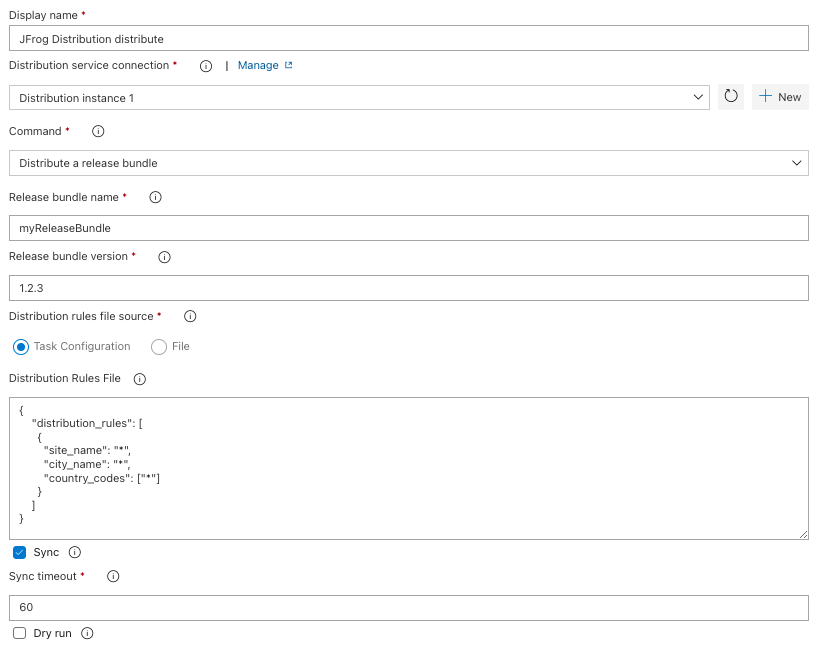

```YAML
- task: JFrogDistribution@1
  inputs:
    command: 'distribute'
    distributionConnection: 'distCon'
    rbName: 'myReleaseBundle'
    rbVersion: '$(Build.BuildNumber)'
    distRulesSource: 'taskConfiguration'
    distSync: true
    maxWaitSync: '40'
```

</details>


<br>

## Contribution


We welcome pull requests from the community!

<details>
    <summary>Building</summary>

### Building

To build and run the extension sources, please follow these steps:

1. Clone the code from git.
2. To Build and create the JFrog Artifactory extension `vsix` file, run the following command.
    ```
    npm i
    npm run create
    ```

After the build process is completed, you'll find the `vsix` file in the project directory.
The `vsix` file can be loaded into Azure DevOps and TFS.

</details>

<details>
    <summary>Testing</summary>

### Testing

To run the tests, please make sure you are using node 14 or above.

Use the following commands to run from terminal:

1. Set the ADO_JFROG_PLATFORM_URL, ADO_JFROG_PLATFORM_USERNAME and ADO_JFROG_PLATFORM_PASSWORD environment variables
   with your JFrog Platform URL, username and password:
    ```
    export ADO_JFROG_PLATFORM_URL='https://myrepo.jfrog.io/'
    export ADO_JFROG_PLATFORM_USERNAME=admin
    export ADO_JFROG_PLATFORM_PASSWORD=password
    ```

2. Run the following commands:
    ```
    npm i -g jfrog-cli-v2-jf
    npm t
    ```

Note: If you are running tests via your IDE, make sure you are registering tests with
ts-node: `mocha -r ts-node/register tests.ts -t 600000`.

#### Skipping Tests

In order to skip tests, set the ADO_SKIP_TESTS environment variable with the tests you wish to skip, separated by
commas.
The supported values are: *maven*, *gradle*, *npm*, *go*, *nuget*, *dotnet*, *conan*, *pip*, *proxy*,
*distribution*, *unit*, *installer* and *generic*.

For example, for skipping the nuget and dotnet tests:

```
export ADO_SKIP_TESTS=nuget,dotnet
```

</details>

<details>
    <summary>Pull request guidelines</summary>

* Pull requests should be created on the *dev* branch.
* Please make sure the code is covered by tests.
* Please run `npm run format` for formatting the code before submitting the pull request.
* Please run `npm run lint` and make sure no new tslint warnings were introduced.

</details>

## Reporting issues

Please help us improve jfrog-azure-devops-extension by [reporting issues](https://github.com/jfrog/jfrog-azure-devops-extension/issues/new/choose) you encounter.

