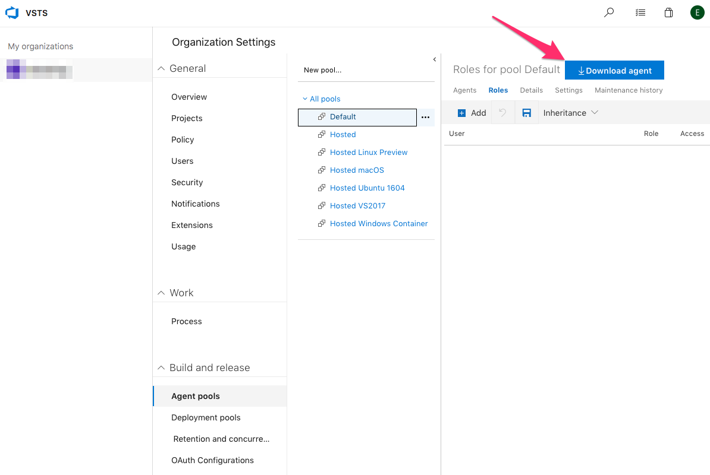
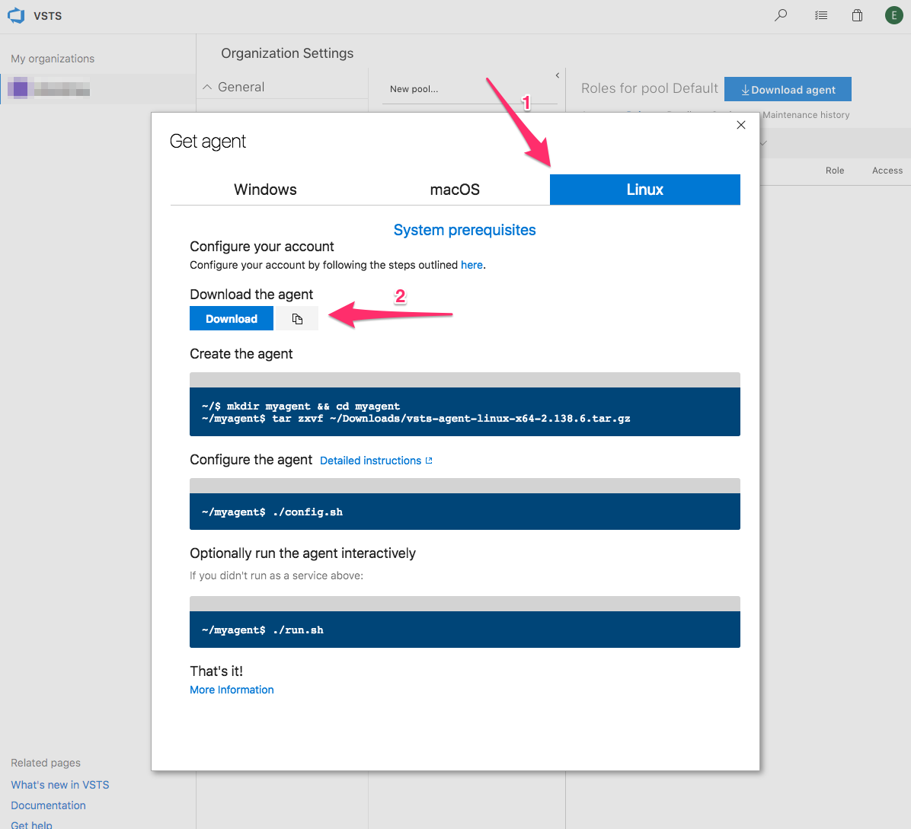
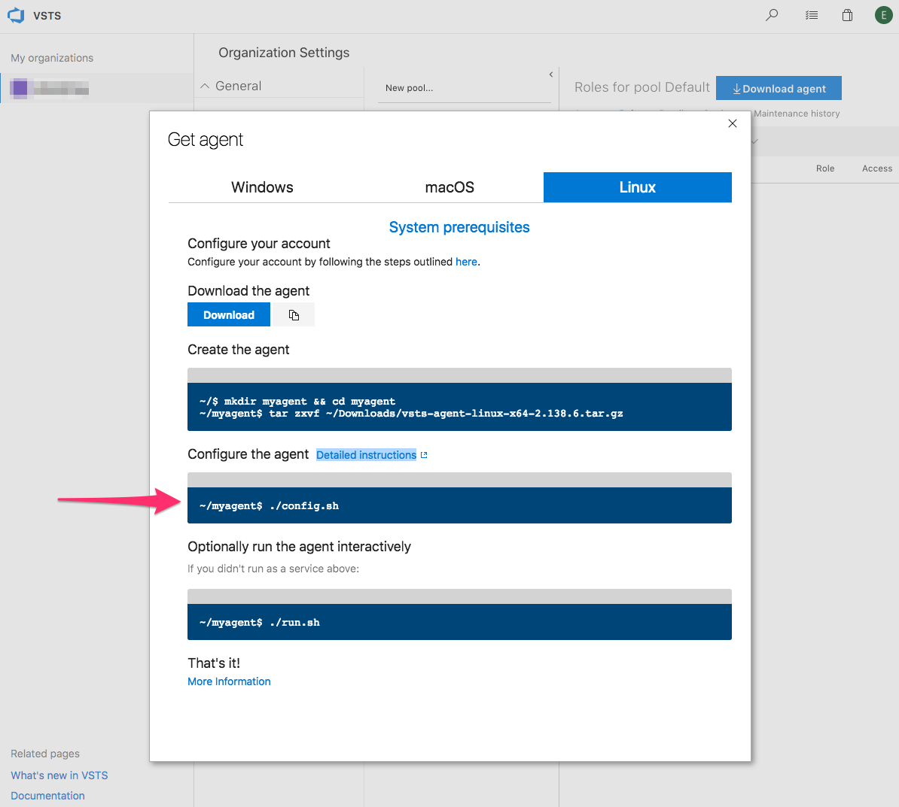
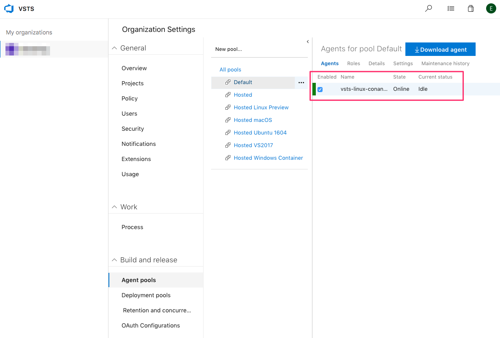

# Artifactory Conan Task

Run Conan commands in your VSTS/TFS build and release pipelines.

## Dependencies

To use this task, you need an Agent with Conan installed and available in the Path.

### Creating Conan enabled Agent for VSTS

1. Create a VM to host your VSTS agent. Use a supported Operating System as described [here](https://docs.microsoft.com/en-us/vsts/pipelines/agents/agents?view=vsts#install).

2. Check if your VM has all the prerequisites to run the VSTS Agent. You can find the list of prerequisites for all supported Operating System in the links below:

    - [Windows](https://github.com/Microsoft/vsts-agent/blob/master/docs/start/envwin.md)
    - [Linux](https://github.com/Microsoft/vsts-agent/blob/master/docs/start/envlinux.md)
    - [OSX](https://github.com/Microsoft/vsts-agent/blob/master/docs/start/envosx.md)

3. Access the VM and install Conan following the steps described [here](https://docs.conan.io/en/latest/installation.html).

4. Confirm that Conan command line tool is available in the Path environment variable of the user you want to use to run the Agent.

5. Create a Personal Access Token (PAT) to be used by the Agent to authenticate against your VSTS organization following the steps described [here](https://docs.microsoft.com/en-us/vsts/pipelines/agents/prepare-permissions?view=vsts)

6. Access the Agent pools configuration page of the VSTS organization where you want to install the Agent at `https://<YOUR_ORGANIZATION_ID>.visualstudio.com/_settings/agentpools?_a=roles`.

7. Create a new Agent pool or select the one you want to use to register your new Agent. VSTS provides the Default Agent pool that can be use to register your self-hosted agents.

8. Click on the button **Download agent**.

9. Select the tab according to your VM Operating System and click on the button to copy the **Download the agent** URL to the clipboard.

10. Access the VM and download the Agent archive using the copied URL.

11. After the download is finished, use the downloaded archive and  the commands described by VSTS to create your Agent folder.

12. Run the configuration wizard to setup your Agent and start it as a service.

13. As soon as the Agent is running, you should be able to see it under the Agent pool. You can now select this Agent pool to run your pipelines using your Agent.

