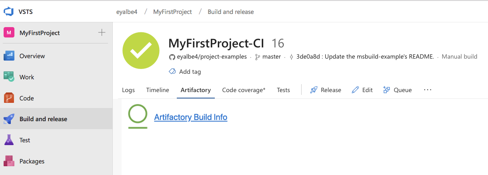
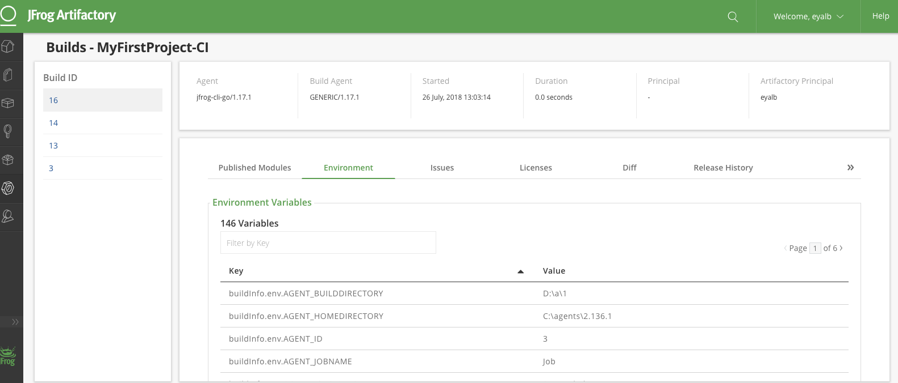

## Overview
**JFrog Artifactory** is a Universal Repository Manager supporting all major packaging formats and build tools.

[Learn more](https://jfrog.com/artifactory/)

Artifactory provides tight integration with TFS and VSTS through the **JFrog Artifactory Extension.** 
In addition to managing efficient deployment of your artifacts to Artifactory, 
the extension lets you capture information about deployed artifacts, 
and resolved dependencies Gain full traceability for your builds as the environment data associated with your build is automatically collected.

## Documentation and Source Code
The full extension documentation is available [here](https://www.jfrog.com/confluence/display/RTF/VSTS+and+TFS+Artifactory+Extension).
 
See the source code is on [GitHub](https://github.com/jfrog/artifactory-vsts-extension).

## Download build dependencies from Artifactory
The **Artifactory Generic Download** task supports downloading your build dependencies from Artifactory to the build agent. 
The task triggers the [JFrog CLI](https://www.jfrog.com/confluence/display/CLI/JFrog+CLI) to perform the download. The downloaded dependencies are defined using [File Specs](https://www.jfrog.com/confluence/display/CLI/CLI+for+JFrog+Artifactory#CLIforJFrogArtifactory-UsingFileSpecs) 
and can also be configured to capture the build-info. 
It will store the downloaded files as dependencies in the build-info which can later be published to Artifactory using the Artifactory Publish Build-Info task.

## Upload build artifacts to Artifactory
The **Artifactory Generic Upload** task supports uploading your generated build artifacts from the build agent's local file system to Artifactory. 
The task triggers the [JFrog CLI](https://www.jfrog.com/confluence/display/CLI/JFrog+CLI) to perform the upload. 
The artifacts are defined using [File Specs](https://www.jfrog.com/confluence/display/CLI/CLI+for+JFrog+Artifactory#CLIforJFrogArtifactory-UsingFileSpecs). 
The task can also be configured to capture build-info and stores the uploaded files as artifacts in the build-info. The captured build-info can be later published to Artifactory using the **Artifactory Publish Build-Info** task.

## Promote published builds 
Artifactory supports promoting published builds from one repository to another, 
to support the artifacts life-cycle. 
The **Artifactory Promotion** task promotes a build, by either copying or moving the build artifacts and/or dependencies to a target repository. 
This task can be added as part of a Release pipeline, to support the release process.

## Access the Build-Info
You can access the build-info from the Build Results in VSTS, if your build pipeline has published the build-info to Artifactory.

