## Overview
**JFrog Artifactory** is a Universal Repository Manager supporting all major packaging formats and build tools.

[Learn more](https://jfrog.com/artifactory/)

Artifactory provides tight integration Azure DevOps through the **JFrog Artifactory Extension.** 
In addition to managing efficient deployment of your artifacts to Artifactory, 
the extension lets you capture information about your build's resolved depedencies and deployed artifacts. 
Gain full traceability for your builds as the environment data associated with your build is automatically collected.

The extension currently supports the following package managers:
Maven, Gradle, npm, NuGet, Docker, Go and Conan. It also allows downloading and uploading generic files from and to Artifactory.

## Documentation and source code
The full extension documentation is available [here](https://www.jfrog.com/confluence/display/JFROG/Artifactory+Azure+DevOps+Extension).
 
See the source code is on [GitHub](https://github.com/jfrog/artifactory-azure-devops-extension).

## Downloading generic build dependencies from Artifactory
The **Artifactory Generic Download** task supports downloading your build dependencies from Artifactory to the build agent. 
The task triggers the [JFrog CLI](https://www.jfrog.com/confluence/display/CLI/JFrog+CLI) to perform the download. The downloaded dependencies are defined using [File Specs](https://www.jfrog.com/confluence/display/CLI/CLI+for+JFrog+Artifactory#CLIforJFrogArtifactory-UsingFileSpecs) 
and can be also configured to capture the build-info. 
It will store the downloaded files as dependencies in the build-info which can later be published to Artifactory using the **Artifactory Publish Build-Info** task.

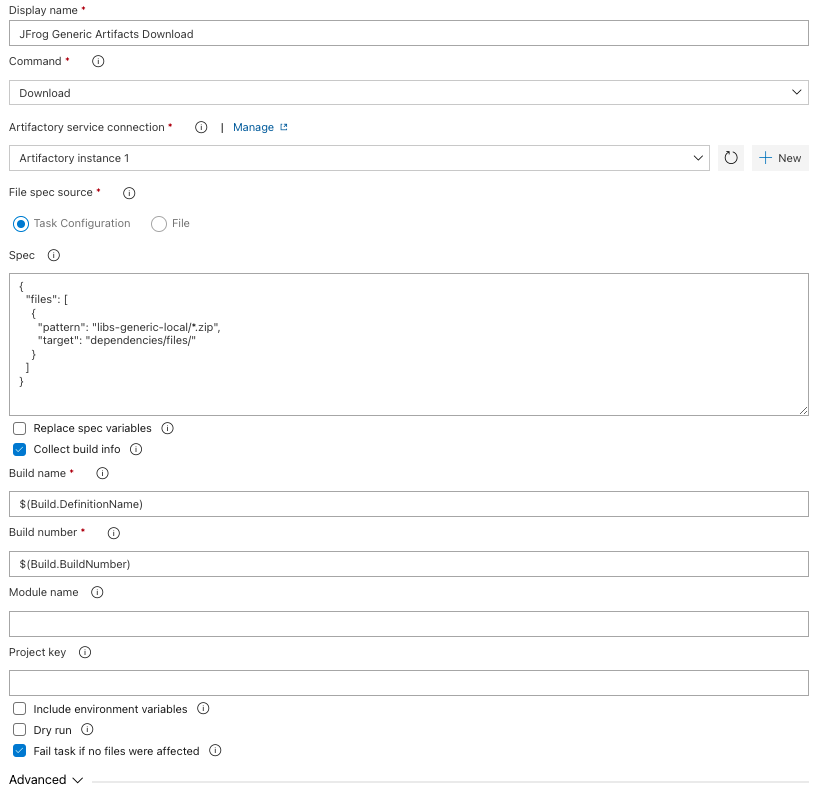

## Uploading generic build artifacts to Artifactory
The **Artifactory Generic Upload** task supports uploading your generated build artifacts from the build agent's local file system to Artifactory. 
The task triggers the [JFrog CLI](https://www.jfrog.com/confluence/display/CLI/JFrog+CLI) to perform the upload. 
The artifacts are defined using [File Specs](https://www.jfrog.com/confluence/display/CLI/CLI+for+JFrog+Artifactory#CLIforJFrogArtifactory-UsingFileSpecs). 
The task can be also configured to capture build-info and stores the uploaded files as artifacts in the build-info. The captured build-info can be later published to Artifactory using the **Artifactory Publish Build-Info** task.

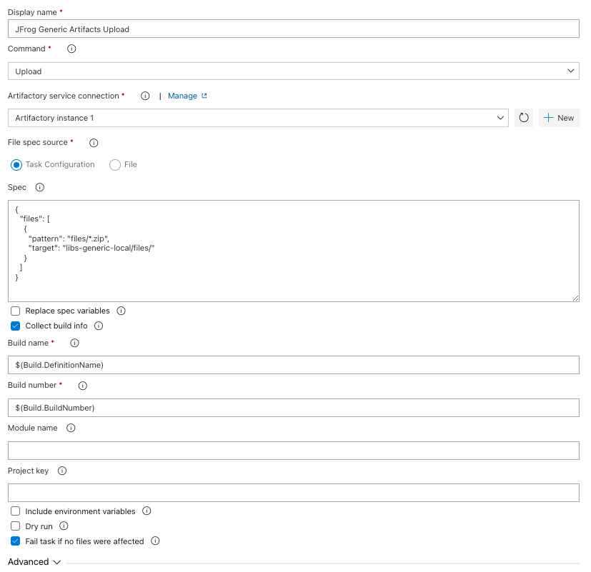

## Triggering nuget, maven, gradle, npm, go and conan builds
The extension adds the the following tasks: **Artifactory Nuget**, **Artifactory Maven**, **Artifactory Gradle**, **Artifactory npm** and **Artifactory Go** to support full build integration with Artifactory. All tasks allow resolving dependencies and deploying artifacts from and to Artifactory. These tasks can also be configured to capture build-info for the build. The captured build-info can be later published to Artifactory using the **Artifactory Publish Build-Info** task.

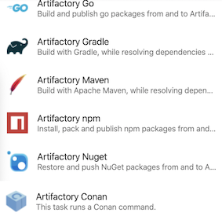

## Pushing and pulling docker images
The **Artifactory Docker** task allows pushing and pulling docker images to and from Artifactory.
The task can also be configured to capture build-info for the build. The captured build-info can be later published to Artifactory using the **Artifactory Publish Build-Info** task.

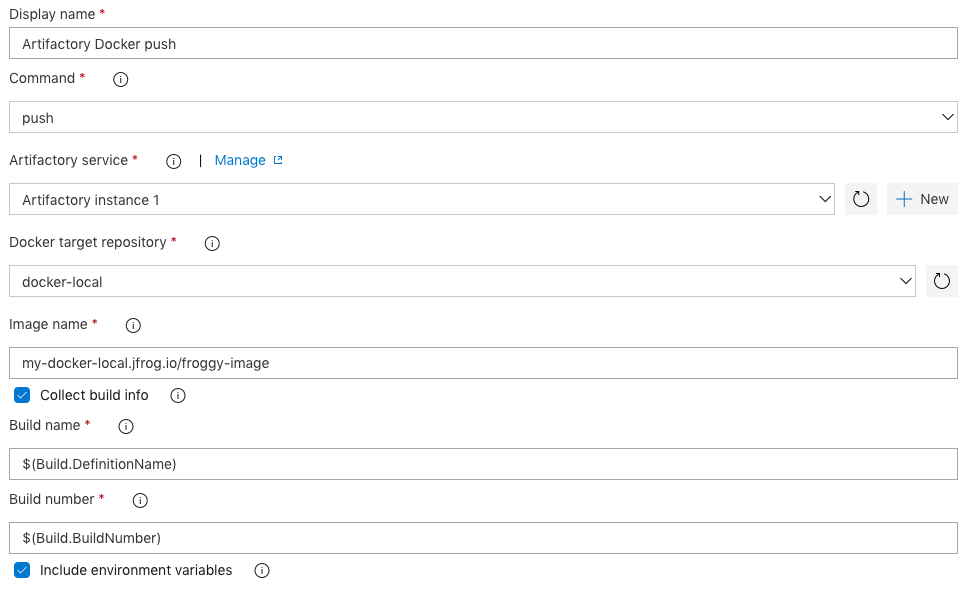

## Setting / deleting properties on files in Artifactory
The **Artifactory Properties** task allows setting and deleting properties on both files in Artifactory.

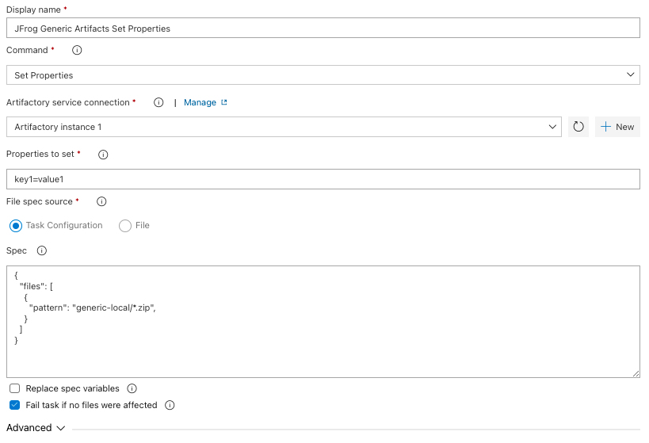

## Scanning builds with JFrog Xray
The JFrog Artifactory extension is integrated with JFrog Xray through JFrog Artifactory, allowing you to have build artifacts scanned for vulnerabilities and other issues using the **Artifactory Xray Scan** task.
If issues or vulnerabilities are found, you may choose to fail a build.

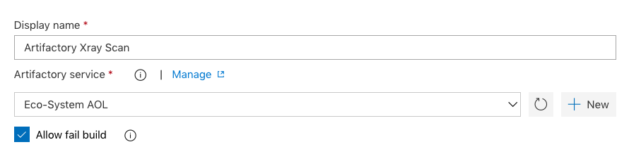

## Recording tracked issues
Being able to look at the build which was published to Artifactory, and see all the tracked issues (from JIRA for example) associated with it, is one of the most powerful capabilities of Artifactory when it comes to managing metadata about builds. The **Artifactory Collect Issues** tasks can automatically identify the issues handled in the current build, and record them as part of the build-info. Read more about this unique capability [here](https://www.jfrog.com/confluence/display/JFROG/Artifactory+Azure+DevOps+Extension#ArtifactoryAzureDevOpsExtension-CollectingBuildIssues).

## Publishing build-info
Build-info captured in preceding tasks can be published to Artifactory using the **Artifactory Publish Build-Info** task.
The configured build name & number should match the ones specified when the build-info was captured.

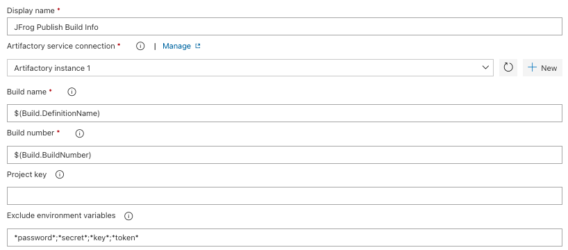

## Promoting published builds 
Artifactory supports promoting published builds from one repository to another, 
to support the artifacts life-cycle. 
The **Artifactory Promotion** task promotes a build, by either copying or moving the build artifacts and/or dependencies to a target repository. 
This task can be added as part of a Release pipeline, to support the release process.

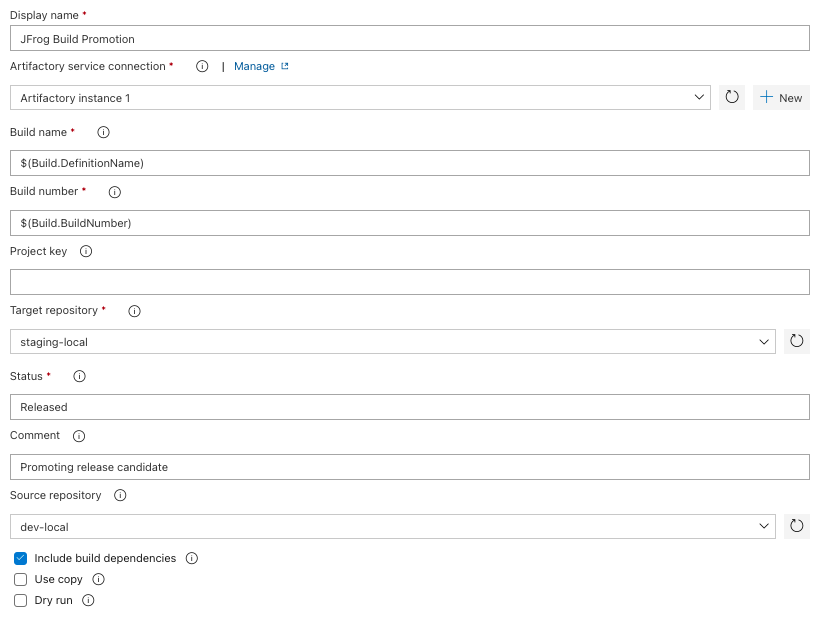

## Discarding published builds 
The **Artifactory Discard Builds** task is used to discard previously published builds from Artifactory.
Builds are discarded according to the retention parameters configured in the task.

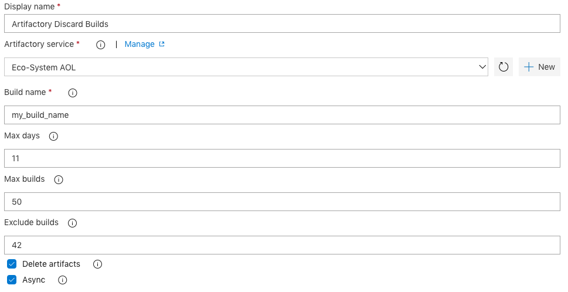

## Accessing the Build-Info and the Xray scan report
You can access the build-info from the Build Results in Azure DevOps, if your build pipeline has published the build-info to Artifactory.
You can also access the Xray scan report, if your build pipeline is configured to scan the build.

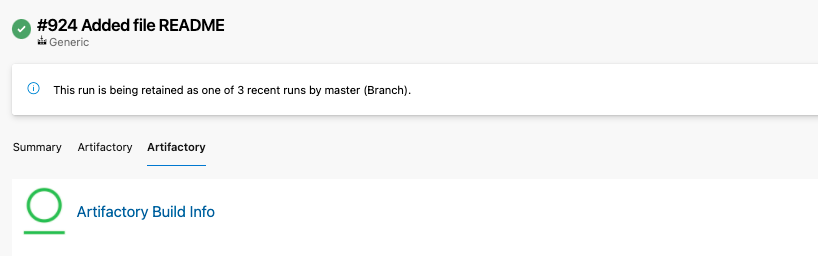
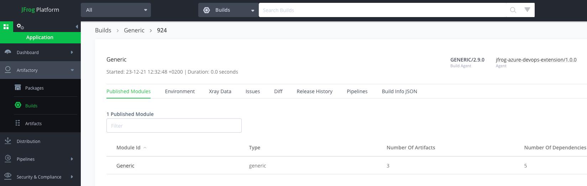
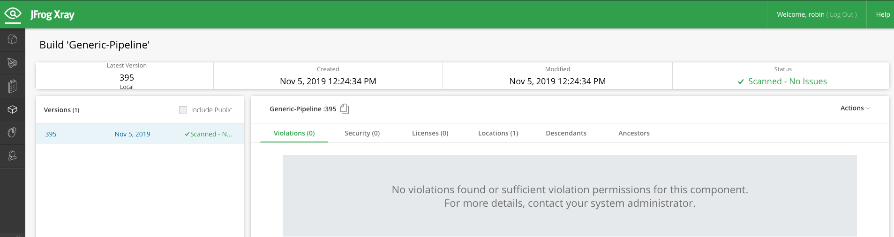

## Releasing published Builds
The **Artifactory Publish Build-Info** task allows publishing builds to Artifactory. By choosing Artifactory as an artifacts source in a Release, 
you can select a published build, to make its artifacts available for the release.

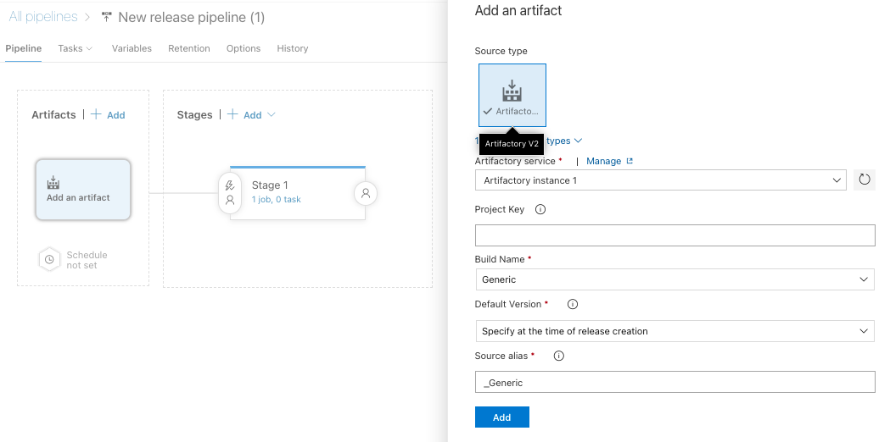
