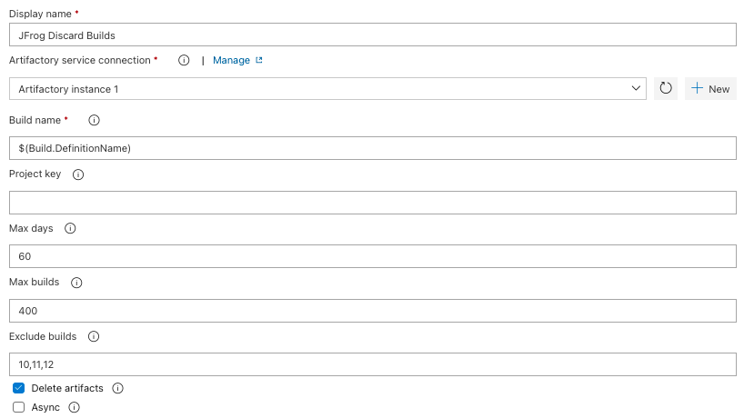

## Overview
**JFrog Artifactory** is a Universal Repository Manager supporting all major packaging formats and build tools.

[Learn more](https://jfrog.com/artifactory/)

Artifactory provides tight integration with TFS and Azure DevOps through the **JFrog Artifactory Extension.** 
In addition to managing efficient deployment of your artifacts to Artifactory, 
the extension lets you capture information about deployed artifacts, 
and resolved dependencies Gain full traceability for your builds as the environment data associated with your build is automatically collected.

The extension currently support generic, maven, npm and nuget builds. 

## Documentation and Source Code
The full extension documentation is available [here](https://www.jfrog.com/confluence/display/RTF/Azure+DevOps+and+TFS+Artifactory+Extension).
 
See the source code is on [GitHub](https://github.com/jfrog/artifactory-vsts-extension).

## Download generic build dependencies from Artifactory
The **Artifactory Generic Download** task supports downloading your build dependencies from Artifactory to the build agent. 
The task triggers the [JFrog CLI](https://www.jfrog.com/confluence/display/CLI/JFrog+CLI) to perform the download. The downloaded dependencies are defined using [File Specs](https://www.jfrog.com/confluence/display/CLI/CLI+for+JFrog+Artifactory#CLIforJFrogArtifactory-UsingFileSpecs) 
and can be also configured to capture the build-info. 
It will store the downloaded files as dependencies in the build-info which can later be published to Artifactory using the **Artifactory Publish Build-Info** task.

## Upload generic build artifacts to Artifactory
The **Artifactory Generic Upload** task supports uploading your generated build artifacts from the build agent's local file system to Artifactory. 
The task triggers the [JFrog CLI](https://www.jfrog.com/confluence/display/CLI/JFrog+CLI) to perform the upload. 
The artifacts are defined using [File Specs](https://www.jfrog.com/confluence/display/CLI/CLI+for+JFrog+Artifactory#CLIforJFrogArtifactory-UsingFileSpecs). 
The task can be also configured to capture build-info and stores the uploaded files as artifacts in the build-info. The captured build-info can be later published to Artifactory using the **Artifactory Publish Build-Info** task.

## Trigger maven builds
The **Artifactory Maven** task allows triggering maven builds, while resolvong dependencies and deploying artifacts from and to Artifactory. 
The task can also be configured to capture build-info for the build. The captured build-info can be later published to Artifactory using the **Artifactory Publish Build-Info** task.

## Trigger npm builds
The **Artifactory Npm** task allows triggering npm builds, while resolvong npm dependencies and deploying npm packages from and to Artifactory. 
The task can be also configured to capture build-info and stores the uploaded files as artifacts in the build-info. The captured build-info can be later published to Artifactory using the **Artifactory Publish Build-Info** task.

## Trigger nuget builds
The **Artifactory Nuget** task allows triggering nuget restore while resolving nuget dependencies from Artifactory. 
It also allows publishing nuget packages to Artifactory.
The task can be also configured to capture build-info and stores the uploaded files as artifacts in the build-info. The captured build-info can be later published to Artifactory using the **Artifactory Publish Build-Info** task.

## Trigger conan builds
The **Artifactory Conan** task allows triggering [conan](https://conan.io/) builds, while resolvong dependencies and deploying artifacts from and to Artifactory. 
The task can also be configured to capture build-info for the build. The captured build-info can be later published to Artifactory using the **Artifactory Publish Build-Info** task.

## Push and Pull docker images
The **Artifactory Docker** task allows pushing and pulling your docker images to and from Artifactory.
The task can also be configured to capture build-info for the build. The captured build-info can be later published to Artifactory using the **Artifactory Publish Build-Info** task.

## Scan builds with Xray
The JFrog Artifactory extension is integrated with JFrog Xray through JFrog Artifactory, allowing you to have build artifacts scanned for vulnerabilities and other issues using the **Artifactory Xray Scan** task.
If issues or vulnerabilities are found, you may choose to fail a build.

## Publish build-info
Build-info captured in preceding tasks can be published to Artifactory using the **Artifactory Publish Build-Info** task.
The configured build name & number should match the ones specified when the build-info was captured.

## Promote published builds 
Artifactory supports promoting published builds from one repository to another, 
to support the artifacts life-cycle. 
The **Artifactory Promotion** task promotes a build, by either copying or moving the build artifacts and/or dependencies to a target repository. 
This task can be added as part of a Release pipeline, to support the release process.

## Discard published builds 
The **Artifactory Discard Builds** task is used to discard previously published builds from Artifactory.
Builds are discarded according to the retention parameters configured in the task.

## Access the Build-Info
You can access the build-info from the Build Results in Azure DevOps, if your build pipeline has published the build-info to Artifactory.

## Release Published Builds
The **Artifactory Publish Build-Info** task allows publishing builds to Artifactory. By choosing Artifactory as an artifacts source in a Release, 
you can select a published build, to make its artifacts available for the release.

