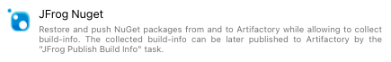

## Overview
The **JFrog Platform** is a leading universal end-to-end DevOps platform for automating, managing, securing, distributing, orchestrating, monitoring, and optimizing your Cl/ CD pipeline.

[Learn more](https://jfrog.com/)

**JFrog Artifactory** provides tight integration with Azure DevOps through the **JFrog Extension.** 
In addition to managing efficient deployment of your artifacts to Artifactory, 
the extension lets you capture information about your build's resolved dependencies and deployed artifacts. 
Gain full traceability for your builds as the environment data associated with your build is automatically collected.

[Learn more](https://jfrog.com/artifactory/)

The extension currently supports the following package managers:
Maven, Gradle, Go, npm, NuGet, .NET Core, Pip and Conan. It also allows downloading and uploading generic files from and to Artifactory, and perform generic tasks on artifacts on Artifactory.

**JFrog Xray** is an application security tool that integrates security directly into your DevOps workflows, enabling you to deliver trusted software releases faster.

[Learn more](https://jfrog.com/xray/)

The extension supports triggering a scan on a published build in Artifactory, or auditing a local project from sources.

**JFrog Distribution** is a centralized platform that lets you provision software release distribution.

[Learn more](https://jfrog.com/distribution/)

The **JFrog Extension** also allows managing Release Bundles and their distribution processes, including release content, and target destinations. 

## Documentation and source code
The full extension documentation is available [here](https://www.jfrog.com/confluence/display/JFROG/Artifactory+Azure+DevOps+Extension).
 
See the source code is on [GitHub](https://github.com/jfrog/artifactory-azure-devops-extension).

## Generic artifacts handling
The **JFrog Generic Artifacts** task allows performing generic actions on artifacts, such as:
1. Downloading and uploading from/to Artifactory
2. Setting or deleting properties on artifacts in Artifactory
3. Moving, copying and deleting artifacts in Artifactory

### Downloading generic build dependencies from Artifactory
The task supports downloading your build dependencies from Artifactory to the build agent. 
The downloaded dependencies are defined using [File Specs](https://www.jfrog.com/confluence/display/CLI/CLI+for+JFrog+Artifactory#CLIforJFrogArtifactory-UsingFileSpecs) 
and can be also configured to capture the build-info. 
It will store the downloaded files as dependencies in the build-info which can later be published to Artifactory using the **JFrog Publish Build-Info** task.

### Uploading generic build artifacts to Artifactory
The task also supports uploading your generated build artifacts from the build agent's local file system to Artifactory. 
The artifacts are defined using [File Specs](https://www.jfrog.com/confluence/display/CLI/CLI+for+JFrog+Artifactory#CLIforJFrogArtifactory-UsingFileSpecs). 
The task can be also configured to capture build-info and stores the uploaded files as artifacts in the build-info. The captured build-info can be later published to Artifactory using the **JFrog Publish Build-Info** task.

### Setting / Deleting properties on files in Artifactory
The JFrog Generic Artifacts task also allows both setting and deleting properties on artifacts in Artifactory.

### Moving / Copying / Deleting artifacts in Artifactory
Same task also allows performing generic actions on artifacts in Artifactory.

## Triggering NuGet, .NET Core CLI, Maven, Gradle, npm, Go, Pip and Conan builds
The extension adds the following tasks - **JFrog NuGet**, **JFrog .NET Core**, **JFrog Maven**, **JFrog Gradle**, **JFrog npm**, **JFrog Go**, **JFrog Pip** and **JFrog Conan** to support full build integration with Artifactory. 

All tasks allow resolving dependencies and deploying artifacts from and to Artifactory. 

These tasks can also be configured to capture build-info for the build. The captured build-info can be later published to Artifactory using the **JFrog Publish Build-Info** task.

## Scanning builds with JFrog Xray
The JFrog Extension integrates with JFrog Xray, allowing you to have build artifacts scanned for vulnerabilities and other issues using the **JFrog Build Scan** task.
If issues or vulnerabilities are found, you may choose to fail the build.

## Audit local projects for vulnerabilities
Using the **JFrog Audit** task, you can trigger a scan on your local project. The task will automatically detect the used package-manager to perform audit with integration with JFrog Xray.
By default, the task will print a table of all vulnerabilities found to the logs. You may configure the task to only show violations, based of a Xray watches source of your preference.
If any violation or vulnerabilities are found, you may choose to fail the build.

## Recording tracked issues
Being able to look at the build which was published to Artifactory, and see all the tracked issues (from JIRA for example) associated with it, is one of the most powerful capabilities of Artifactory when it comes to managing metadata about builds. The **JFrog Collect Issues** tasks can automatically identify the issues handled in the current build, and record them as part of the build-info. Read more about this unique capability [here](https://www.jfrog.com/confluence/display/JFROG/Artifactory+Azure+DevOps+Extension#ArtifactoryAzureDevOpsExtension-CollectingBuildIssues).

## Publishing build-info
Build-info captured in preceding tasks can be published to Artifactory using the **JFrog Publish Build-Info** task.
The configured build name & number, and the optional project key, should match the ones specified when the build-info was captured.

## Promoting published builds 
Artifactory supports promoting published builds from one repository to another, 
to support the artifacts life-cycle. 
The **JFrog Promotion** task promotes a build, by either copying or moving the build artifacts and/or dependencies to a target repository. 
This task can be added as part of a Release pipeline, to support the release process.

## Discarding published builds 
The **JFrog Discard Builds** task is used to discard previously published builds from Artifactory.
Builds are discarded according to the retention parameters configured in the task.

## Executing JFrog CLI commands
The **JFrog CLI V2** task allows executing [JFrog CLI](https://www.jfrog.com/confluence/display/CLI/JFrog+CLI) commands, while using the pre-configured connection details of JFrog Platform, stored in Azure DevOps.

## Accessing the Build-Info and the Xray scan report
You can access the build-info from the Build Results in Azure DevOps, if your build pipeline has published the build-info to Artifactory.

## Releasing published builds
The **JFrog Publish Build-Info** task allows publishing builds to Artifactory. By choosing Artifactory as an artifacts source in a Release, 
you can select a published build, to make its artifacts available for the release.

## Handling Distribution
The **JFrog Distribution** task allows managing release bundles.
The task provides the capability to create, update, sign, distribute or delete release bundles from JFrog Distribution.

## Behind the scenes
Most tasks trigger the [JFrog CLI](https://www.jfrog.com/confluence/display/CLI/JFrog+CLI) to perform the requested actions.
The extension handles downloading and caching the JFrog CLI, which is done once per pipeline.
You can configure the used JFrog CLI version, and configure to download it from your Artifactory instance using the **JFrog Tools Installer** task.